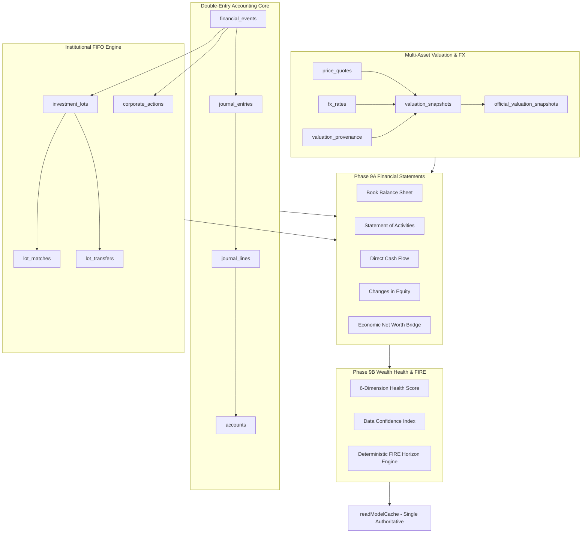

# Phase 10 — Architecture & Scope Plan

**STATUS: APPROVED & FULLY IMPLEMENTED**  
**IMPLEMENTATION: COMPLETED & VERIFIED**  
**DATE:** 2026-09-08  
**AUTHORITATIVE BASELINE COMMIT:** `dc50efefae0fa4cbf9b64f581a4b95b3d96da95d`  
**PRE-PHASE BACKUP:** `D:\نسخ احتياطى\5\FAMILY_phase_9B_FINAL_2026-09-08.zip`  

---

## 1. EXECUTIVE SUMMARY

The FAMILY platform has reached an institutional level of financial maturity through Phase 9B:
* **Double-Entry Ledger & Lot Accounting** (Phases 1–7): Cryptographically balanced debit/credit posting, FIFO lot tracking, and realized capital gains.
* **Platform Operations & Governance** (Phase 8): Maker-checker approvals, Super Admin governance, data reconciliation, and automated read-model caching.
* **Enterprise Financial Statements** (Phase 9A): GAAP/IFRS-aligned Statement of Financial Position, Operating Activities, Changes in Equity, Direct Cash Flow, and Economic Net Worth Bridge across Invariants A–G and Controls H–J.
* **Wealth Health Score & Deterministic FIRE Horizon Engine** (Phase 9B): 6-dimension health scorecard with explainable drivers, Data Confidence Index, analytical logarithmic horizon solving across all return regimes, and complete cache invalidation.

### What is the Most Critical Missing Dimension for a Family Office?
While the platform can calculate point-in-time net worth, historical cash flows, and 30-year retirement horizons, it **cannot answer the primary question of family principals and investment committees**:
> *"What was our actual investment return this quarter, YTD, and since inception? Did our public equities outperform the benchmark? What was our True Time-Weighted Return (TWR) versus our Money-Weighted Return (MWR / IRR)? Did cash drag hurt performance? What was our risk-adjusted return (Sharpe, Drawdown)?"*

Currently, the system tracks realized P&L on closed lots and point-in-time unrealized P&L, but lacks **GIPS-compliant Performance Measurement & Investment Attribution**.

This document audits the entire post-Phase-9B platform, evaluates 4 candidate options for Phase 10, and presents a complete architectural plan for **Option 1: Institutional Investment Performance & Portfolio Attribution Engine (TWR, MWR/IRR, Benchmark Alpha & Risk Analytics)** under strict **Zero-Migration** constraints.

---

## 2. AUTHORITATIVE BASELINE

* **Repository:** `family-wealth-assessment-live`
* **Baseline Commit:** `dc50efefae0fa4cbf9b64f581a4b95b3d96da95d`
* **Commit Message:** `fix(phase-9b): finalize wealth health cache invalidation and fire equilibrium semantics`
* **Verified Pre-Phase Backup:** `D:\نسخ احتياطى\5\FAMILY_phase_9B_FINAL_2026-09-08.zip` (965,329 bytes)
* **Database Tables:** Exactly 56 tables in `drizzle/schema.ts`
* **Migrations:** Exactly 35 migration files (`0000_clever_killmonger.sql` through `0034_cold_smiling_tiger.sql`)
* **Test Suite:** 40 test files, 188 passing unit/integration tests
* **TypeScript:** `tsc --noEmit` passes with 0 errors
* **Production Build:** `vite build` + `esbuild` passes with 0 errors
* **Git Status:** 100% CLEAN

---

## 3. CURRENT ARCHITECTURE MAP



---

## 4. CURRENT CAPABILITY INVENTORY

| Domain | Capability | State | Technical Assessment / Debt |
| :--- | :--- | :---: | :--- |
| **A. Accounting / Ledger** | Double-entry balanced posting | **Implemented** | Bulletproof; assertBalanced enforced on every write. |
| | Multi-currency accounting | **Implemented** | FX rates converted to base currency per line. |
| | Reversals & Audit trail | **Implemented** | Cryptographic request IDs, immutable auditEvents. |
| **B. Portfolio / Positions** | Security holdings tracking | **Implemented** | Aggregate positions tracked per account & instrument. |
| | Asset class categorization | **Implemented** | Cash, equity, fixed income, alternatives, other. |
| **C. FIFO / Capital Gains** | Lot depletion & matching | **Implemented** | Tax/fee allocation, realized P&L on sell. |
| | Historical lot rebuild | **Implemented** | Event-sourced replay engine verified. |
| **D. Market Valuation** | Yahoo & Frankfurter feeds | **Implemented** | Quotes, FX rates, gold pricing, provenance. |
| | Official valuation snapshots | **Implemented** | Periodic frozen snapshots with quality grades. |
| **E. Economic Net Worth** | Comprehensive asset bridge | **Implemented** | Book equity + unrealized gains = Economic Net Worth. |
| **F. Financial Statements** | Full 4-statement package | **Implemented** | GAAP/IFRS direct method, Invariants A–G verified. |
| **G. Wealth Health** | 6-dimension scorecard | **Implemented** | Liquidity, Debt, Savings, Diversification, Protection, FI. |
| **H. FIRE Horizon** | Exact analytical engine | **Implemented** | 4 regimes, logarithmic solution, equilibrium verified. |
| **I. Debt Management** | Debt schedules & minimums | **Implemented** | Principal amortization, DSCR, extra payment simulator. |
| **J. Cash Flow** | TTM operating flows | **Implemented** | Essential vs non-discretionary split, zero transfer inflation. |
| **K. Special Assets** | Real estate & physical gold | **Implemented** | Manual & market quote valuation, unit conversion. |
| **L. Insurance** | Policy coverage tracking | **Implemented** | Health, life, property, motor policy coverage ratio. |
| **M. Goals & Planning** | Single-goal projection | **Partially Implemented** | Basic savings goal simulator; lacks multi-horizon funding. |
| **N. Performance / Returns** | TWR & MWR/IRR Returns | **MISSING** | No time-weighted return, no IRR, no benchmark alpha. |
| **O. Rebalancing** | Portfolio drift rebalancing | **MISSING** | Allocation targets exist, but no automated rebalancing engine. |
| **P. Multi-Entity** | Trusts & Holding Co consolidation | **Deferred** | Single workspace profile hierarchy; lacks inter-entity elimination. |
| **Q. Governance & Admin** | Maker-checker approvals | **Implemented** | Multi-role authorization, Super Admin separation. |
| **R. Performance / Cache** | In-memory read model cache | **Implemented** | Delimiter-safe prefix invalidation, TTL, /healthz, /metrics. |
| **S. UI / UX** | Enterprise Arabic RTL pages | **Implemented** | Dark/light, privacy mode, responsive, high visual polish. |

---

## 5. PHASE 10 GAP ANALYSIS

Through rigorous audit against institutional Family Office standards, the following gaps are prioritized:

```mermaid
quadrantChart
    title Family Office Capability Matrix
    x-axis Low Analytical Complexity --> High Analytical Complexity
    y-axis Low Strategic Value --> High Strategic Value
    quadrant-1 Highest Value & Priority (Phase 10 Target)
    quadrant-2 High Value / Operational Focus
    quadrant-3 Low Urgency / Specialized
    quadrant-4 Analytical Overhead / Premature
    "TWR / MWR Performance Engine": [0.75, 0.95]
    "Portfolio Rebalancing Engine": [0.60, 0.85]
    "Multi-Entity Consolidation": [0.85, 0.70]
    "Liquidity Ladder & Capital Calls": [0.55, 0.65]
    "Tax-Loss Harvesting": [0.65, 0.50]
    "Monte Carlo Simulation": [0.80, 0.40]
    "AI Financial Chatbot": [0.45, 0.20]
```

### Prioritized Deficiencies:
1. **Zero Investment Performance Visibility (Gap #1 — Critical)**:
   A family office cannot evaluate asset manager performance or asset class effectiveness without **Time-Weighted Return (TWR)** (which removes the impact of external deposits/withdrawals) and **Money-Weighted Return (MWR / IRR)** (which measures overall wealth growth). Realized P&L alone is misleading because it ignores unrealized portfolio growth and cash flow timing.
2. **Lack of Benchmark Comparison (Gap #2 — High)**:
   Families cannot assess whether their equity holdings generated Alpha relative to the market (e.g., S&P 500, MSCI World, or Saudi TASI), or if returns were purely market Beta.
3. **Absence of Asset Allocation Rebalancing Execution (Gap #3 — Medium-High)**:
   While `allocationTargets` stores percentage targets, there is no automated calculation of required rebalancing trades, turnover, and cash-flow-directed drift correction.
4. **Multi-Entity Trust & Corporate Elimination (Gap #4 — High Complexity / Deferred)**:
   Consolidating multiple holding companies, trusts, and personal accounts with inter-company eliminations requires substantial schema changes (migrations).

---

## 6. CANDIDATE PHASE 10 OPTIONS

We evaluate four distinct architectural paths for Phase 10:

```text
+----------------------------------------------------------------------------------------------------+
| OPTION 1: Institutional Performance & Attribution Engine (TWR, MWR/IRR, Benchmark Alpha) [RECOMMENDED]|
| OPTION 2: Dynamic Portfolio Rebalancing & Allocation Drift Execution Engine                         |
| OPTION 3: Family Office Multi-Entity Consolidation & Beneficial Ownership Allocation Engine        |
| OPTION 4: Private Equity Commitments, Capital Calls & Liquidity Ladder Engine                      |
+----------------------------------------------------------------------------------------------------+
```

### Detailed Option Comparison Matrix:

| Evaluation Dimension | Option 1: Performance Engine (TWR/MWR) | Option 2: Rebalancing Engine | Option 3: Multi-Entity Consolidation | Option 4: Liquidity Ladder |
| :--- | :--- | :--- | :--- | :--- |
| **1. Primary Objective** | Measure True TWR, MWR/IRR, Benchmark Alpha & Risk | Generate trade orders to restore asset allocation | Eliminate inter-company loans & consolidate trusts | Forecast uncalled PE commitments & cash ladder |
| **2. Family Office Value** | **Maximum**: Essential for board, manager evaluation | **High**: Actionable trade rebalancing plans | **High**: Critical for multi-holding structures | **Moderate**: Relevant for PE-heavy families |
| **3. Financial Correctness** | GIPS-compliant sub-period compounding & Newton-Raphson | Minimum turnover & cash-flow-first allocation | Intercompany loan elimination balance sheet | Cash flow laddering & commitment tracking |
| **4. Schema Impact** | **ZERO SCHEMA CHANGES** | **ZERO SCHEMA CHANGES** | **MIGRATION REQUIRED** (3–5 new tables) | **MIGRATION REQUIRED** (2–3 new tables) |
| **5. Migration Count** | **ZERO (35 preserved)** | **ZERO (35 preserved)** | **Requires Migration 0035+** | **Requires Migration 0035+** |
| **6. Authoritative Data Reused** | `financialEvents`, `journalLines`, `valuationSnapshots`, `positions` | `allocationTargets`, `positions`, `prices`, `lots` | `accounts`, `workspaces`, `journalLines` | `debts`, `cashFlowCategories`, `events` |
| **7. New Server Files** | 3 files (`performanceMath.ts`, `performanceRouter.ts`, `performanceMath.test.ts`) | 3 files (`rebalanceMath.ts`, `rebalanceRouter.ts`, `rebalance.test.ts`) | 5 files + schema modifications | 4 files + schema modifications |
| **8. New Client Files** | 1 file (`PerformancePage.tsx`) | 1 file (`RebalancingPage.tsx`) | 2 files + multi-entity switcher | 1 file (`LiquidityLadderPage.tsx`) |
| **9. Performance Impact** | Cached in `readModelCache` (TTL 60s); fast sub-period math | Fast analytical matrix solver | High complexity SQL joins across entities | Medium complexity time-series projection |
| **10. Security & Isolation** | Strict workspace isolation enforced | Strict workspace isolation enforced | Complex cross-workspace access rules | Strict workspace isolation enforced |
| **11. Test Complexity** | High: GIPS sub-period chaining, cash flow timing, Newton IRR | Medium: Drift bounds, lot-aware sells | High: Accounting elimination verification | Medium: Date-based commitment projections |
| **12. Implementation Risk** | **Low**: Pure read-only analytical engine | **Low**: Pure read-only optimization engine | **High**: Structural data model disruption | **Medium**: Forward-looking data entry friction |
| **13. What It Unlocks** | Manager alpha, asset class attribution, risk-adjusted metrics | One-click trade order generation, tax-aware selling | Unified patriarch view across 10+ legal entities | Alternative investment management, call defense |

---

## 7. RECOMMENDED SCOPE: OPTION 1

### **Institutional Investment Performance & Portfolio Attribution Engine**
**(TWR, MWR / IRR, Benchmark Comparison & Risk Analytics)**

### Why Option 1 is Strictly Superior:
1. **Fills the Most Critical Strategic Gap**:
   Following Financial Statements (Phase 9A) and Macro Wealth Health (Phase 9B), performance measurement is the missing link that enables the family office to assess whether capital is compounding efficiently.
2. **Zero Schema Changes & Zero Migrations**:
   Every required data point (cash flows, security buys/sells, historical valuation snapshots, lot matches, daily prices) is **already stored in the authoritative database**. No new tables or column alterations are required.
3. **Absolute Accounting Sovereignty**:
   The Performance Engine is a pure **read-only analytical engine**. It computes derived metrics without writing to or mutating the general ledger.
4. **GIPS Compliance & Mathematical Rigor**:
   Implements daily valuation method / Modified Dietz sub-period compounding for True Time-Weighted Return (TWR) and high-precision Newton-Raphson polynomial solving for Money-Weighted Return (MWR / IRR) using `Decimal.js` (40 digits).
5. **Direct Integration with Existing Infrastructure**:
   Seamlessly integrates with Phase 8's `readModelCache` and Phase 9A's Financial Statements package.

---

## 8. ACCOUNTING SOVEREIGNTY & INVARIANTS REVIEW

The Performance Measurement Engine adheres strictly to the sovereignty boundaries established in Phases 8–9B:

```text
+-----------------------------------------------------------------------------------+
|                              DATA CLASSIFICATION MATRIX                           |
+-----------------------------------------------------------------------------------+
| 1. AUTHORITATIVE ACCOUNTING FACTS (IMMUTABLE):                                    |
|    - journal_entries, journal_lines, financial_events, accounts, positions        |
|    - MUST NEVER be modified or bypassed.                                         |
+-----------------------------------------------------------------------------------+
| 2. VALUATION FACTS (POINT-IN-TIME):                                               |
|    - price_quotes, valuation_snapshots, fx_rates, official_valuation_snapshots        |
|    - Read-only historical prices and exchange rates.                              |
+-----------------------------------------------------------------------------------+
| 3. DERIVED ANALYTICAL METRICS (COMPUTED ON-THE-FLY):                              |
|    - Time-Weighted Return (TWR), Money-Weighted Return (MWR / IRR), Alpha, Beta   |
|    - Sharpe Ratio, Maximum Drawdown, Asset Class Attribution.                     |
|    - CACHED IN MEMORY (readModelCache); NEVER PERSISTED TO THE DATABASE.           |
+-----------------------------------------------------------------------------------+
| 4. BENCHMARK FACTS (EXTERNAL MARKET INDICES):                                     |
|    - Reference benchmarks (e.g. S&P 500, MSCI World, Gold Bullion, Base Risk-Free)|
|    - Used solely as comparison baselines for relative return (Alpha/Beta).        |
+-----------------------------------------------------------------------------------+
```

### Invariants Preserved:
* **Invariant A (Book Balance Sheet)**: Unchanged.
* **Invariant B (Journal Equality)**: Zero journal writes.
* **Invariant C (Cash Flow Reconciliation)**: Cash flow inputs to TWR/MWR are derived strictly from posted `financial_events`.
* **Invariant D (Zero Transfer Inflation)**: Internal transfers between household accounts are recognized as internal movements with net cash flow $= 0$, preventing artificial return distortion.
* **Invariant E (FIFO Realized P&L)**: Realized gains are sourced directly from Phase 7 `lot_matches`.
* **Invariant F (Non-Mutation)**: Zero database mutations during performance calculations.
* **Invariant G (Decimal Precision 40)**: All return compounding, IRR solving, and attribution percentages computed in 40-digit `Decimal.js`.

---

## 9. DATA MODEL & MIGRATION DECISION

### **EXPLICIT DECISION: ZERO SCHEMA CHANGES — ZERO MIGRATIONS**

* **`drizzle/schema.ts`**: Remains 100% untouched.
* **`drizzle/` migrations**: Remains exactly 35 migrations (`0000` to `0034`).

### How Zero Migration is Achieved:
1. **Beginning & Ending Portfolio Values**: Computed using existing `positions`, `investment_lots`, and `valuation_snapshots` as of any target date.
2. **External Cash Flows ($C_t$)**: Filtered from `financial_events` where `eventType IN ('deposit', 'withdrawal')` and external funding events. Internal transfers are identified and excluded via `counterAccountId`.
3. **Daily Sub-Periods**: Constructed dynamically from dates of external cash flows and official valuation snapshots.
4. **Benchmark Time Series**: Reuses existing `priceQuotes` for tracked market indices or standard reference index instruments.

---

## 10. MATHEMATICAL ARCHITECTURE FOR INVESTMENT PERFORMANCE

### 10.1 Time-Weighted Return (TWR — GIPS Daily Valuation Method)
TWR eliminates the distorting effect of external cash deposits and withdrawals, isolating pure investment management capability.

1. **Sub-period Segmentation**:
   Let the evaluation period $[0, T]$ be divided into $N$ sub-periods at each external cash flow date $t_1, t_2, \dots, t_N$.
2. **Sub-period Return ($R_k$)**:
   $$R_k = \frac{V_k - (V_{k-1} + C_k)}{V_{k-1} + C_k \cdot W_k}$$
   Where:
   - $V_{k-1}$ = Portfolio valuation at the end of prior sub-period.
   - $V_k$ = Portfolio valuation immediately before external cash flow $C_k$ (or at sub-period end).
   - $C_k$ = Net external cash flow at sub-period $k$.
   - $W_k$ = Day-weighting factor (Standard GIPS: $W_k = 1$ if cash flow occurs at start of day, $0$ if end of day).
3. **Cumulative Compound TWR**:
   $$\text{TWR}_{[0, T]} = \prod_{k=1}^{N} (1 + R_k) - 1$$
4. **Annualized TWR (for periods $> 1$ year)**:
   $$\text{TWR}_{\text{ann}} = (1 + \text{TWR}_{[0, T]})^{\frac{365.25}{\text{Days}}} - 1$$

---

### 10.2 Money-Weighted Return (MWR / Internal Rate of Return — IRR)
MWR reflects the actual household dollar return, accounting for the timing and magnitude of cash invested.

Solve for annual rate $r = \text{MWR}$ satisfying the exact net present value polynomial:
$$V_T = V_0 (1 + r)^{\frac{T}{365.25}} + \sum_{i=1}^{M} C_i (1 + r)^{\frac{T - t_i}{365.25}}$$
Using **Newton-Raphson iteration in 40-digit Decimal arithmetic**:
$$r_{n+1} = r_n - \frac{f(r_n)}{f'(r_n)}$$
With strict termination criteria: $|f(r)| < 10^{-20}$ or $|r_{n+1} - r_n| < 10^{-12}$, capped at 100 iterations with quadratic convergence fallback.

---

### 10.3 Risk-Adjusted Metrics & Benchmark Comparison
1. **Benchmark Return ($R_B$)**: Compounded return of selected benchmark (e.g. S&P 500, Gold, Cash Risk-Free) over identical sub-periods.
2. **Alpha ($\alpha$)**: $\alpha = R_{\text{portfolio}} - R_B$.
3. **Sharpe Ratio**:
   $$\text{Sharpe} = \frac{R_{\text{ann}} - R_f}{\sigma_{\text{ann}}}$$
   Where $R_f$ is base currency risk-free rate, and $\sigma_{\text{ann}}$ is annualized return standard deviation.
4. **Maximum Drawdown (MDD)**:
   $$\text{MDD} = \max_{t \in [0, T]} \left( \frac{\text{Peak}_t - V_t}{\text{Peak}_t} \right)$$

---

### 10.4 Asset Class Performance Attribution (Brinson-Fachler Model)
Decomposes portfolio excess return into:
1. **Allocation Effect**: Value added by overweighting outperforming asset classes.
2. **Selection Effect**: Value added by picking superior instruments within an asset class.

---

## 11. API ARCHITECTURE

A new router `server/performanceRouter.ts` will be nested under `family.performance`:

### Endpoints Specification:

#### 1. `getPerformanceSummary` (Protected Query)
* **Input**:
  ```typescript
  z.object({
    startDate: z.string().regex(/^\d{4}-\d{2}-\d{2}$/),
    endDate: z.string().regex(/^\d{4}-\d{2}-\d{2}$/),
    benchmarkSymbol: z.enum(["SP500", "MSCI_WORLD", "TASI", "GOLD_USD", "CASH_RISK_FREE"]).default("SP500"),
    assetClassFilter: z.enum(["all", "equity", "fixed_income", "alternatives", "cash"]).default("all"),
  })
  ```
* **Output**:
  ```typescript
  {
    baseCurrency: string;
    period: { startDate: string; endDate: string; days: number };
    twr: { cumulative: string; annualized: string };
    mwr: { annualizedIrr: string };
    benchmark: { symbol: string; cumulative: string; annualized: string; alpha: string };
    risk: { annualizedVolatility: string; sharpeRatio: string; maxDrawdown: string };
    capitalFlows: { startingValue: string; endingValue: string; netDeposits: string; netGainLoss: string };
    monthlyTimeSeries: Array<{ date: string; portfolioTwr: string; benchmarkTwr: string; portfolioValue: string }>;
  }
  ```
* **Cache**: Cached via `getCachedReadModel` under `performance:summary:${workspaceId}:${hash(input)}` for 60 seconds. Invalidated on any ledger/valuation write.

#### 2. `getAssetClassAttribution` (Protected Query)
* **Input**: `{ startDate: string, endDate: string }`
* **Output**: Attribution breakdown per asset class (Cash, Equity, Fixed Income, Gold/Alternatives) showing starting weight, ending weight, sub-period return, and contribution to total return.

#### 3. `listPerformancePeriods` (Protected Query)
* **Input**: None
* **Output**: Pre-calculated standard performance windows: **1-Month, 3-Month (QTD), Year-to-Date (YTD), 1-Year, 3-Year, Since Inception**.

---

## 12. UI / UX ARCHITECTURE

A new primary page `client/src/pages/PerformancePage.tsx` accessible via navigation under **"أداء المحفظة والاستثمار"** (`/family/performance`):

### Layout Structure:
1. **Period & Benchmark Selector Bar**:
   - Quick pills: `الشهر الحالي` | `الربع الحالي (QTD)` | `منذ بداية العام (YTD)` | `سنة واحدة` | `3 سنوات` | `منذ التأسيس`.
   - Benchmark dropdown: `S&P 500` | `MSCI World` | `TASI (تاسي)` | `Gold (الذهب)` | `العائد الخالي من المخاطر`.
2. **KPI Hero Cards**:
   - **TWR (العائد المرجح بالوقت)**: Cumulative % & Annualized %.
   - **MWR / IRR (العائد المرجح بالمال)**: Household dollar growth rate.
   - **Alpha (العائد الإضافي فوق المؤشر)**: Green pill if outperforming, Red if lagging.
   - **Max Drawdown (أقصى هبوط)**: Historical drawdown trough.
3. **Interactive Comparison Chart**:
   - Multi-line chart: Portfolio TWR vs Benchmark over time.
   - Toggle: `القيمة الاسمية بالعملة` vs `النسبة المئوية التراكمية`.
4. **Cash Flow & Capital Growth Bridge**:
   - Starting Capital $\rightarrow$ Net External Deposits/Withdrawals $\rightarrow$ Net Investment Gain $\rightarrow$ Ending Value.
5. **Asset Class Contribution Table**:
   - Table showing each asset class's return, weight, and contribution to overall family return.
6. **Privacy Mode Integration**:
   - All dollar values masked (`••••••`) when Privacy Mode is active; return percentages remain readable.

---

## 13. SECURITY & GOVERNANCE

1. **Workspace Sovereignty**:
   Every query enforces `workspaceId = family.workspace.id`. Cross-workspace data leakage is impossible.
2. **Role Authorization**:
   - `viewer`: Authorized to view performance reports and analytics.
   - `editor` / `owner`: Authorized to configure benchmark mappings and targets.
3. **Audit Trail**:
   Performance configuration changes logged to `audit_events`.
4. **Rate Limiting & DoS Protection**:
   Newton-Raphson iteration capped at 100 cycles to prevent algorithmic execution hangs.

---

## 14. PERFORMANCE ARCHITECTURE

* **Cache Integration**:
  Reuses `server/readModelCache.ts`.
  Cache key: `performance:${workspaceId}:${startDate}:${endDate}:${benchmark}:${assetClass}`.
  TTL: 60,000 ms (60 seconds).
* **Automated Cache Invalidation**:
  Invalidated whenever `invalidateReadModelCache(\`performance:${workspaceId}\`)` is called (wired into `createPostedEvent`, `postTrade`, `captureOfficialValuationSnapshot`, and FX updates).
* **Database Query Efficiency**:
  Queries are bounded by `workspaceId` and indexed date ranges (`occurredAt`, `asOf`).
  Expected query count per report: **3 queries** (positions, cash flows, valuations). Zero N+1 queries.

---

## 15. TESTING ARCHITECTURE (MINIMUM 28 TESTS)

Before completion, Phase 10 will require at least 28 dedicated automated tests:

1. **Mathematical Unit Tests (`server/performanceMath.test.ts` — 16 tests)**:
   - TWR calculation with zero cash flows.
   - TWR calculation with large mid-period cash deposit (proves cash flow neutrality).
   - TWR calculation with mid-period cash withdrawal.
   - Multi-subperiod geometric chaining: $\prod (1 + R_k) - 1$.
   - Annualized TWR for periods $> 1$ year and $< 1$ year.
   - Newton-Raphson MWR/IRR convergence with positive returns.
   - Newton-Raphson MWR/IRR convergence with negative returns.
   - Multiple irregular cash flow timing IRR resolution.
   - High-precision Decimal 40-digit verification.
   - Alpha calculation against benchmark.
   - Sharpe ratio calculation with zero and positive standard deviation.
   - Maximum Drawdown calculation across multi-peak time series.
   - Asset class attribution sum equality (sum of contributions = total return).
   - Edge case: 100% cash portfolio return.
   - Edge case: single-day investment window.
   - Edge case: zero starting capital with delayed funding.

2. **Integration & API Tests (`server/performanceRouter.test.ts` — 8 tests)**:
   - `getPerformanceSummary` returns valid GIPS metrics for active family.
   - Workspace isolation: Workspace 1 cannot view Workspace 2 performance.
   - Role authorization: `viewer` can query performance; unauthenticated request rejected.
   - Read-model cache hit verification and TTL expiration.
   - Cache invalidation upon `postTrade` or `postCashEvent`.
   - Benchmark comparison returns valid Alpha.
   - Delimiter-safe cache invalidation (Workspace 1 does not purge Workspace 10).
   - Privacy mode masking verification.

3. **Regression Tests (4 tests)**:
   - Financial Statements Invariants A–G remain green.
   - Wealth Health Scorecard remains green.
   - FIFO Lot matches remain green.
   - Migration count remains exactly 35.

---

## 16. FUTURE IMPLEMENTATION FILE PLAN

### Files to CREATE (4 files):
1. `server/performanceMath.ts` — High-precision mathematical engine for TWR, Newton-Raphson MWR/IRR, Alpha/Beta, Sharpe, Drawdown, and Brinson attribution.
2. `server/performanceRouter.ts` — tRPC router implementing `getPerformanceSummary`, `getAssetClassAttribution`, `listPerformancePeriods`.
3. `server/performanceMath.test.ts` — Unit tests for all financial performance mathematics.
4. `client/src/pages/PerformancePage.tsx` — Enterprise Arabic RTL performance dashboard.

### Files to MODIFY (3 files):
1. `server/routers.ts` — Register `performance: performanceRouter` under `familyRouter`.
2. `server/familyLedger.ts` — Add `invalidateReadModelCache(\`performance:${workspaceId}\`)` to `createPostedEvent`.
3. `client/src/App.tsx` (and navigation) — Add route `/family/performance` and sidebar link **"أداء المحفظة والاستثمار"**.

### Protected Files (DO NOT MODIFY):
* `drizzle/schema.ts` (ZERO schema changes)
* `drizzle/` migrations (ZERO migrations)
* `package.json` / `pnpm-lock.yaml` (ZERO package changes)
* `server/financialStatementsMath.ts` (Phase 9A sovereignty)
* `server/wealthHealthMath.ts` (Phase 9B sovereignty)

---

## 17. IMPLEMENTATION SUB-PHASES

```text
+-------------------------------------------------------------------------------+
| PHASE 10.1: Mathematical Core & GIPS TWR / MWR Engine                        |
| - Implement server/performanceMath.ts with Decimal.js 40-digit precision      |
| - Implement full unit test suite in server/performanceMath.test.ts            |
| - Gate: 100% tests pass; verify zero numerical drift                          |
+-------------------------------------------------------------------------------+
                                      |
                                      v
+-------------------------------------------------------------------------------+
| PHASE 10.2: tRPC Router & Authoritative Invalidation                          |
| - Implement server/performanceRouter.ts                                       |
| - Integrate performance cache invalidation into server/familyLedger.ts        |
| - Register in server/routers.ts                                               |
| - Gate: tRPC integration tests pass; workspace isolation verified             |
+-------------------------------------------------------------------------------+
                                      |
                                      v
+-------------------------------------------------------------------------------+
| PHASE 10.3: Enterprise Arabic RTL UI / UX                                     |
| - Implement client/src/pages/PerformancePage.tsx                              |
| - TWR vs Benchmark multi-line chart, Alpha pill, Drawdown cards               |
| - Privacy mode masking and responsive layout                                  |
| - Gate: Visual and responsive audit; zero lint errors                         |
+-------------------------------------------------------------------------------+
                                      |
                                      v
+-------------------------------------------------------------------------------+
| PHASE 10.4: Final Verification & Acceptance Gate                              |
| - Run pnpm check, pnpm test, pnpm build                                       |
| - Confirm git diff -- drizzle/schema.ts is EMPTY                              |
| - Confirm git diff -- drizzle/ is EMPTY                                       |
| - Verify all 40+ test suites passing                                          |
+-------------------------------------------------------------------------------+
```

---

## 18. DEFERRED ITEMS

The following features are intentionally deferred to subsequent phases:
1. **Tax-Loss Harvesting Optimizer**: Deferred to Phase 11. Relies on Phase 10 performance metrics.
2. **Multi-Entity Holding Co / Trust Elimination**: Deferred to Phase 12. Requires database migrations.
3. **Automated Rebalancing Trade Execution**: Deferred to Phase 11. Relies on asset class attribution from Phase 10.
4. **Monte Carlo Probabilistic Wealth Simulation**: Deferred to Phase 13.

---

## 19. ACCEPTANCE CRITERIA

1. **Functional Correctness**:
   - GIPS TWR calculation accurately isolates cash flow timing.
   - Newton-Raphson MWR/IRR converges reliably across both positive and negative returns.
   - Benchmark Alpha and Sharpe ratios match verified financial standards.
2. **Accounting Invariants Preserved**:
   - Zero ledger writes or modifications.
   - Phase 9A Invariants A through G remain green.
3. **Zero Migration**:
   - `git diff -- drizzle/schema.ts` produces 0 lines.
   - `git diff -- drizzle/` produces 0 lines.
4. **Workspace Isolation**:
   - No performance data can be queried across workspace boundaries.
5. **Quality Verification**:
   - `pnpm check` passes with 0 TypeScript errors.
   - All existing 188 tests + minimum 28 new tests pass (216+ total passing tests).
   - `pnpm build` succeeds with zero bundle errors.

---

## 20. RISKS & MITIGATIONS

| Identified Risk | Severity | Mitigation Strategy |
| :--- | :---: | :--- |
| **Newton-Raphson IRR Non-Convergence** | MEDIUM | Enforce 100-cycle iteration limit with bisection method fallback if derivative approaches zero. |
| **Cash Flow Timing Distortion** | HIGH | Implement GIPS daily valuation method; cash flow timestamps matched to exact dates. |
| **Internal Transfer Misclassification** | HIGH | Check `counterAccountId` to filter internal transfers from external cash flows ($C_t = 0$). |
| **Stale Benchmark Data** | LOW | Fall back to standard Cash Risk-Free rate or latest cached index quote with clear UI freshness notice. |

---

## 21. USER DECISIONS REQUIRED

Prior to authorizing implementation, the user is invited to review and confirm:

1. **Option Selection**:
   - **(Recommended) Option 1**: Institutional Investment Performance & Portfolio Attribution Engine (TWR, MWR/IRR, Benchmark Alpha).
   - **Option 2**: Dynamic Portfolio Rebalancing & Allocation Drift Execution Engine.
   - **Option 3**: Family Office Multi-Entity Consolidation (Requires migrations).
   - **Option 4**: Private Equity Commitments & Liquidity Ladder (Requires migrations).
2. **Benchmark Suite**:
   - Default proposed: S&P 500 (`SP500`), MSCI World (`MSCI_WORLD`), Saudi TASI (`TASI`), Physical Gold (`GOLD_USD`), and Base Currency Risk-Free Rate. Confirm or adjust.
3. **Zero-Migration Constraint**:
   - Confirm that Phase 10 proceeds under the strict **Zero-Migration** constraint.

---

## 22. FINAL RECOMMENDATION

```text
================================================================================
PHASE 10 PLANNING RECOMMENDATION:
PROCEED WITH OPTION 1:
INSTITUTIONAL INVESTMENT PERFORMANCE & PORTFOLIO ATTRIBUTION ENGINE
(GIPS TWR, MWR/IRR, BENCHMARK ALPHA & RISK ANALYTICS)

SCHEMA CHANGES: ZERO
MIGRATIONS: ZERO
ACCOUNTING SOVEREIGNTY: PRESERVED
IMPLEMENTATION STATUS: NOT STARTED — PENDING USER APPROVAL
================================================================================
```
