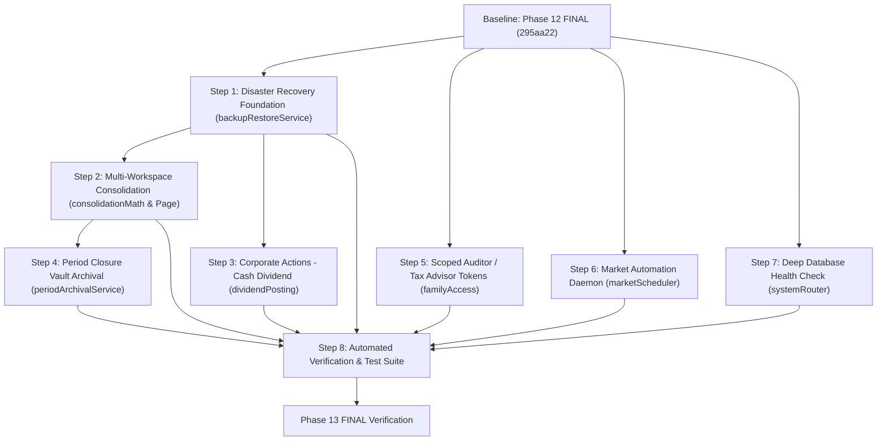

# Phase 13 Implementation Plan & Pre-Execution Engineering Audit
**Milestone:** Phase 13 — Family Office Multi-Entity Consolidation & Disaster Recovery Continuity  
**Authoritative Baseline:** Phase 12 FINAL (`commit 295aa22 — feat(phase-12): institutional ux and frontend hardening`)  
**Audit Mode:** READ-ONLY Engineering Pre-Execution Audit  
**Operating Discipline:** Zero source code changes, zero migrations, zero schema modifications, zero new npm dependencies, zero git commits.

---

## 1. Executive Summary

Phase 12 established institutional-grade UX and frontend hardening across all 24 primary user screens, backed by a fully tested and invariant double-entry accounting engine, FIFO lot allocation, GIPS-compliant performance attribution, and Mulberry32 deterministic stress testing.

This pre-execution audit evaluates the proposed scope for **Phase 13: Family Office Multi-Entity Consolidation & Disaster Recovery Continuity**.

### Key Pre-Audit Findings & Ground Truth Corrections
By auditing the actual codebase rather than relying on prior gap reports, two major implementation realities were uncovered:
1. **Stock Split Execution Already Implemented:** `postStockSplit` is already fully written in `server/familyLedger.ts`, exposed in `server/familyRouter.ts` under `family.lots.stockSplit`, and integrated into `client/src/pages/LotAccountingPage.tsx`. Only Cash Dividend allocation across lots is missing.
2. **Active Database Health Ping Already Implemented:** An active `SELECT 1` database health check is already operational at `app.get("/readyz")` in `server/_core/index.ts`, alongside `/healthz` and `/metrics`. Only the tRPC `systemRouter.health` query remains a lightweight ping.
3. **51 Workspace-Owned Relational Tables Identified:** A true full-state disaster recovery backup must serialize exactly 51 workspace-scoped tables (not merely summary metrics) with a SHA-256 integrity manifest.
4. **Strict Zero-Schema & Zero-Package Discipline Proven:** All Phase 13 capabilities can be executed with **0 schema changes, 0 migrations, and 0 new packages**, utilizing existing project infrastructure (`decimal.js`, `vaultCrypto.ts`, `corporate_actions`, `financial_events`, `wouter`, and Radix UI).

**Pre-Execution Audit Verdict:** **GO (Approved for Implementation Planning).**

---

## 2. Current-State Findings by Architecture Domain

| System Domain | Current Implementation & Repository Reality | Audit Assessment |
| :--- | :--- | :--- |
| **Double-Entry Ledger** | Strict balanced debit/credit engine in `server/familyLedger.ts` and `server/ledgerMath.ts`. Projections drive balances. Reversing entries (`reversePosted`) enforce immutability. | **100% Invariant.** No gaps. Must not be modified. |
| **Financial Statements** | Three-statement generator in `server/financialStatementsMath.ts` and `server/financialStatementsRouter.ts`. Fully reconciles against posted journal lines. | **Complete.** Can be called directly for period closure archival. |
| **FIFO Lot Accounting** | Acquisition queue and match calculations in `server/lots.ts` and `server/lotRebuild.ts`. Proportional fee/tax allocation verified. | **Complete.** Invariant. |
| **Corporate Actions** | `postStockSplit` exists in `familyLedger.ts`, router, and UI. Cash dividend per-share distribution across active lots is missing. | **Partial.** Stock split is complete; cash dividend workflow required. |
| **Multi-Workspace Isolation** | Workspaces strictly isolated by `workspaceId` in all 51 relational tables. No cross-workspace queries exist. | **Complete for single-entity; Missing consolidated roll-up.** |
| **Disaster Recovery** | `family.backup.snapshot` only dumps 6 aggregate numbers from `getDashboardSummary`. No restore endpoint exists. | **Genuinely Inadequate.** High institutional risk. |
| **Period Closure Archival** | `financialPeriods` locks posting on closed periods, but generates statements dynamically without permanent sealing into `vault_documents`. | **Partial.** Statements not cryptographically sealed on closure. |
| **Auditor / Tax Access** | 4 static roles (`viewer`, `editor`, `advisor`, `owner`). Invitations support `expiresAt`, but accepted memberships become permanent and broad. | **Partial.** Lacks time-bound auto-expiration and route scoping. |
| **Market Data Refresh** | `refreshYahooMarketData` and `/api/cron/market-refresh` exist for external webhooks. No internal fallback timer. | **Operational on-demand; lacks internal fallback.** |
| **Operational Health** | `/readyz` executes `SELECT 1` on MySQL; `/healthz` reports uptime; `/metrics` reports memory/latency. | **Operational at Express level; tRPC query is static.** |

---

## 3. Recommendation-by-Recommendation Audit

---

### P1 — Item 1: Multi-Workspace / Multi-Entity Consolidated Roll-Up
- **Gap Verification:** Verified. No consolidation service exists in `server/familyRead.ts` or `server/familyRouter.ts`.
- **Existing Foundations:** `workspaces`, `memberships`, `accounts`, `positions`, `fx_rates`, `financialStatementsMath.ts`.
- **Genuinely Missing:** A read-only service that takes a target reporting currency, verifies membership authorization across requested workspace IDs, aggregates book assets/liabilities, derives economic net worth, and outputs combined asset allocation.
- **Accounting Safety & Elimination Rules:**
  - *Critical Accounting Invariant:* Consolidation MUST BE READ-ONLY. It must **never** post consolidation adjustment entries into underlying workspace ledgers.
  - *Inter-Entity Elimination Truth:* In the current schema, there is no foreign key linking an IOU or account in Workspace A to Workspace B. Therefore, **automated inter-entity elimination cannot be blindly guessed**. Attempting to eliminate loans by matching text strings is an accounting hazard. The engine must compute **Gross Consolidated Net Worth** and provide an explicit **Inter-Entity Reconciliation Disclosure** where users flag matching internal receivables/payables.
  - *Distinction:* Clearly separates **Book Consolidated Net Worth** (ledger balances) from **Economic Consolidated Net Worth** (official asset valuations).
- **Schema & Package Changes:** **ZERO**.
- **Complexity:** **MEDIUM**.

---

### P1 — Item 2: Full-State Workspace Disaster Recovery Backup, Restore & Clone
- **Gap Verification:** Verified. Current `backup.snapshot` is only a summary snapshot; no restore engine exists.
- **Existing Foundations:** All 51 workspace-owned tables defined in `drizzle/schema.ts`, `vaultCrypto.ts`.
- **Genuinely Missing:**
  1. Full relational exporter serializing all 51 workspace-owned tables into a canonical JSON envelope.
  2. SHA-256 integrity hash calculation over the payload.
  3. Pre-restore validation dry-run (verifying format version, table schemas, row counts, and foreign key integrity).
  4. Idempotent transactional restore engine supporting two distinct modes:
     - **Restore Mode (In-Place Recovery):** Overwrites/re-populates the target workspace inside an atomic transaction.
     - **Clone Mode (New Entity Creation):** Instantiates a new workspace with a new name and ID, copying all 51 tables with remapped foreign keys.
- **Relational Scope (Exactly 51 Tables):**
  `memberships`, `workspace_invitations`, `financial_profiles`, `accounts`, `instruments`, `cash_flow_categories`, `financial_events`, `budgets`, `recurring_rules`, `debts`, `debt_payments`, `emergency_fund_plans`, `journal_entries`, `journal_lines`, `positions`, `price_quotes`, `valuation_provenance`, `valuation_snapshots`, `official_valuation_snapshots`, `fx_rates`, `financial_goals`, `retirement_plans`, `risk_profiles`, `allocation_targets`, `watchlist_items`, `market_email_preferences`, `market_email_deliveries`, `research_notes`, `fee_tax_rules`, `special_assets`, `special_asset_valuations`, `insurance_policies`, `insurance_premium_payments`, `bank_statement_imports`, `bank_statement_rows`, `audit_events`, `approval_policies`, `approval_requests`, `approval_decisions`, `financial_periods`, `budget_templates`, `budget_template_lines`, `planning_scenarios`, `personal_ious`, `insurance_claims`, `zakat_assessments`, `vault_documents`, `investment_lots`, `lot_transfers`, `corporate_actions`, `lot_matches`.
- **Exclusions (Platform-Level):** `users`, `platform_ownership`, `platform_audit_events`, `platform_admin_invitations` (never overwritten by a tenant restore).
- **Schema & Package Changes:** **ZERO**.
- **Complexity:** **MEDIUM**.

---

### P1 — Item 3: Automated Fiscal Period Closure & Cryptographic Vault Archival
- **Gap Verification:** Verified. Period closure sets `financial_periods.status = 'closed'`, but does not seal statements into `vault_documents`.
- **Existing Foundations:** `financialPeriods` in `drizzle/schema.ts`, `generateFinancialStatementsPackage()` in `server/financialStatementsRouter.ts`, `encryptVaultValue()` in `server/vaultCrypto.ts`, `vault_documents` table.
- **Genuinely Missing:** An automated trigger in period close workflow that:
  1. Calls `generateFinancialStatementsPackage(family, { periodKey })`.
  2. Formats a canonical JSON audit dossier (Balance Sheet, Income Statement, Cash Flow, Reconciliation Certificate).
  3. Computes SHA-256 hash of the unencrypted dossier.
  4. Encrypts payload with AES-256-GCM via `encryptVaultValue`.
  5. Inserts into `vault_documents` (`documentType: "financial_statement"`, `memo: "[ختم الفترة المالية #periodKey - SHA256: ...]"`).
  6. Records an immutable audit log entry in `audit_events`.
  7. Prevents duplicate archival if closure is re-evaluated.
- **Accounting Safety:** Generates reports strictly from posted ledger lines; zero modification of financial data.
- **Schema & Package Changes:** **ZERO**.
- **Complexity:** **LOW to MEDIUM**.

---

### P1 — Item 4: Corporate Actions Lifecycle (Cash Dividend Allocation)
- **Gap Verification:** Corrected audit finding. Stock split is **already complete** (`postStockSplit`). Only Cash Dividend allocation across lots is genuinely missing.
- **Existing Foundations:** `financialEvents.eventType = 'dividend'`, `accounts`, `investment_lots`, `positions`, `familyLedger.ts`.
- **Genuinely Missing:** Cash dividend transaction workflow:
  - Input: `instrumentId`, `cashAccountId`, `dividendPerShare`, `exDate`, `paymentDate`, `withholdingTaxAmount`, `memo`, `idempotencyKey`.
  - Eligibility calculation: derives eligible shares held in the designated cash account's custodian/brokerage on `exDate` from open `investmentLots`.
  - Double-Entry Posting Semantics:
    - Total Gross Dividend = `eligibleShares * dividendPerShare`.
    - Net Cash Received = `totalGrossDividend - withholdingTaxAmount`.
    - **Debit:** Cash Account for `netCashReceived` (Asset increases).
    - **Debit:** Tax Expense Account for `withholdingTaxAmount` (Expense increases).
    - **Credit:** Dividend Income System Account (`DIVIDEND_INCOME:[CURRENCY]`) for `totalGrossDividend` (Revenue increases).
    - Balanced: `Debits == Credits`.
  - Lot Invariance: Cash dividends do NOT alter lot quantities or cost bases.
- **Schema & Package Changes:** **ZERO**.
- **Complexity:** **LOW to MEDIUM**.

---

### P1 — Item 5: Scoped, Time-Bound Auditor / Tax Advisor Guest Access
- **Gap Verification:** Verified. Invitations accept permanent memberships without route scoping.
- **Existing Foundations:** `workspace_invitations` (has `expiresAt`, `acceptedByUserId`, `role`), `memberships` (role `viewer`), `familyAccess.ts`.
- **Genuinely Missing:**
  1. Temporary auditor flag/metadata stored in the invitation record.
  2. Middleware/guard in `familyAccess.ts`:
     - Checks if active membership originated from an auditor invitation.
     - Enforces `Date.now() < invitation.expiresAt`. If expired, rejects with `TRPCError FORBIDDEN: "انتهت صلاحية وصول المراجع المالي"`.
     - Route gating: limits access strictly to read-only financial routes:
       - Allowed: `/reports`, `/reconciliation`, `/zakat`, `/lot-accounting`, `/performance`.
       - Blocked: `/vault`, `/members`, `/settings`, `/admin/*`, all mutation procedures.
- **Schema & Package Changes:** **ZERO**.
- **Complexity:** **LOW**.

---

### P2 — Item 6: Automated End-of-Day Market Data Refresh Daemon
- **Gap Verification:** Verified. Handled by external webhook (`handleScheduledMarketRefresh`); lacks in-process fallback timer.
- **Existing Foundations:** `refreshYahooMarketData()`, `sendEligibleMarketReviewEmails()`, `marketRefreshHandler.ts`.
- **Genuinely Missing:** An in-process background timer in `server/_core/index.ts` that runs once daily (e.g. 17:00 Cairo time), checks elapsed time since last refresh, acquires a lightweight DB lock (`GET_LOCK('family_eod_market_refresh', 5)` to prevent cluster concurrency), runs the existing refresh routine, and invalidates derived read-model caches.
- **Package Changes:** **ZERO** (Uses native Node.js `setInterval` and MySQL locking).
- **Complexity:** **LOW**.

---

### P2 — Item 7: Deep MySQL Connection Pool Health Check
- **Gap Verification:** Corrected audit finding. Express `/readyz` already runs `SELECT 1`. Only `systemRouter.health` tRPC query needs to report pool latency and active database status.
- **Existing Foundations:** `getDb()` in `server/db.ts`, `server/_core/systemRouter.ts`.
- **Genuinely Missing:** Upgrade `systemRouter.health` to execute a measured `SELECT 1` ping and return `{ ok: true, database: { connected: true, latencyMs: number } }` with a 2000ms timeout protection.
- **Schema & Package Changes:** **ZERO**.
- **Complexity:** **LOW**.

---

## 4. Implementation Map

| Recommendation | Existing File / Table | New or Modified File | Nature of Implementation |
| :--- | :--- | :--- | :--- |
| **1. Multi-Workspace Consolidation** | `workspaces`, `memberships`, `accounts`, `positions`, `fx_rates` | `server/consolidationMath.ts` **[NEW]** `server/consolidationRouter.ts` **[NEW]** `client/src/pages/ConsolidationPage.tsx` **[NEW]** `client/src/components/DashboardLayout.tsx` **[MODIFY]** | Multi-entity roll-up math, tRPC router with membership validation, consolidated balance sheet page, navigation item. |
| **2. Disaster Recovery Engine** | All 51 workspace tables in `drizzle/schema.ts`, `backupSnapshot.ts` | `server/backupRestoreService.ts` **[NEW]** `server/familyRouter.ts` **[MODIFY]** `client/src/pages/FamilyExportPage.tsx` **[MODIFY]** | Full relational JSON exporter, SHA-256 manifest, transactional restore/clone engine, UI file upload/restore confirmation dialog. |
| **3. Period Vault Archival** | `financialPeriods`, `vault_documents`, `vaultCrypto.ts` | `server/periodArchivalService.ts` **[NEW]** `server/familyRouter.ts` **[MODIFY]** | Dossier generator, SHA-256 sealing, AES-256 encryption, hook into `requestPeriodClose` execution. |
| **4. Corporate Actions (Dividends)** | `financial_events`, `corporate_actions`, `familyLedger.ts` | `server/dividendPosting.ts` **[NEW]** `server/familyRouter.ts` **[MODIFY]** `client/src/pages/LotAccountingPage.tsx` **[MODIFY]** | Per-share dividend eligibility derivation, double-entry balanced cash posting, Corporate Actions UI tab. |
| **5. Scoped Auditor Access** | `workspace_invitations`, `memberships`, `familyAccess.ts` | `server/familyAccess.ts` **[MODIFY]** `client/src/components/DashboardLayout.tsx` **[MODIFY]** | Expiration timestamp verification, route whitelist guard, auditor role UI badge. |
| **6. Market Data Daemon** | `marketRefresh.ts`, `server/_core/index.ts` | `server/marketScheduler.ts` **[NEW]** `server/_core/index.ts` **[MODIFY]** | In-process daily timer with MySQL distributed lock and error fallback. |
| **7. Deep Health Check** | `systemRouter.ts`, `server/db.ts` | `server/_core/systemRouter.ts` **[MODIFY]** | Measured `SELECT 1` ping with latency and timeout guard. |

---

## 5. Dependency Graph

---

## 6. Accounting Safety Analysis

Every proposed financial interaction strictly complies with non-negotiable accounting rules:

1. **Strict Double-Entry Equality:**
   - Cash Dividend: `Debits (Cash + Tax Withholding) === Credits (Dividend Income)`. Verified before commit.
   - Stock Split: Balance remains balanced via zero-value memo event linked to system clearing account.
2. **Ledger as Authority:** Account balances and holdings remain pure projections of posted journal lines. No shadow balances.
3. **FIFO Lot Integrity:**
   - Stock splits scale lot quantities by `ratio` and divide unit cost by `ratio`. Total cost basis (`quantity * unitCost`) is mathematically invariant.
   - Cash dividends do not consume or alter lots; lot lineage is unaffected.
4. **Historical Immutability:** Closed periods reject posting; corrections require reversing entries (`reversePosted`).
5. **Decimal.js Precision:** All currency calculations use `Decimal.js` (rounding mode: `ROUND_HALF_UP`, 6 decimal places for money, 8 for quotes and quantities).
6. **Consolidation Non-Mutation:** The consolidation layer is strictly read-only. It executes zero mutations and posts zero journal entries.

---

## 7. Security, RBAC & Workspace Isolation Analysis

1. **Workspace Boundary:** Every single-workspace query scopes by `workspaceId`. Consolidation validates that `ctx.user.id` has an active membership in *every* requested workspace ID before aggregating.
2. **Role Enforcement:**
   - Full Disaster Recovery Restore: Requires `owner` role.
   - Full Backup Export: Requires `advisor` or `owner` role.
   - Corporate Actions (Dividends & Splits): Requires `advisor` or `owner` role.
   - Period Closure: Requires `owner` or `advisor` approval.
3. **Auditor Gating:** Users tagged as temporary auditors are restricted to HTTP GET/query operations on whitelisted routes (`/reports`, `/reconciliation`, `/zakat`, `/lot-accounting`, `/performance`). All mutation procedures throw `TRPCError FORBIDDEN`.
4. **Vault Protection:** Archived period dossiers are encrypted with AES-256-GCM using `process.env.JWT_SECRET`. Unencrypted files are never written to disk.

---

## 8. Cache Invalidation Matrix

| Mutation Event | Cache Keys / Prefixes to Invalidate | Invalidation Method |
| :--- | :--- | :--- |
| **Cash Dividend Posted** | `wealth-health:score:${workspaceId}` `stress-testing:${workspaceId}:` `consolidation:` | `invalidateReadModelCache()` |
| **Stock Split Executed** | `wealth-health:score:${workspaceId}` `stress-testing:${workspaceId}:` `consolidation:` | `invalidateReadModelCache()` |
| **Workspace Restored** | All keys matching `${workspaceId}` | `invalidateReadModelCache(workspaceId)` |
| **Period Closed & Archived** | `financial-statements:${workspaceId}:` | `invalidateReadModelCache()` |
| **Market Data Refresh** | `wealth-health:score:` `stress-testing:` `consolidation:` | `invalidateReadModelCache()` |

---

## 9. Schema & Dependency Discipline: The Zero-Change Proof

### 1. Database Schema Proof
All proposed tables, columns, and relations already exist in `drizzle/schema.ts`:
- **Consolidation:** Queries existing `workspaces`, `accounts`, `positions`, `fx_rates`.
- **Disaster Recovery:** Serializes existing 51 workspace tables into JSON.
- **Period Archival:** Inserts into existing `vault_documents` (`documentType: "financial_statement"`, payload encrypted in `storagePath` or `fileData`).
- **Corporate Actions (Dividends):** Inserts into existing `financial_events` (`eventType: "dividend"`), `journal_entries`, `journal_lines`, and `accounts`.
- **Auditor Tokens:** Evaluates existing `workspace_invitations.expiresAt` and `memberships.role`.
- **Health Check & Scheduler:** Uses existing database connection.

**Conclusion:** **EXACTLY ZERO SCHEMA CHANGES AND ZERO MIGRATIONS REQUIRED.**

### 2. Package Dependency Proof
All required capabilities are supported by existing packages:
- Cryptographic hashes: Native Node.js `crypto` (`createHash("sha256")`).
- Authenticated Encryption: Native Node.js `crypto` (`createCipheriv("aes-256-gcm")`).
- Exact Math: `decimal.js` (already installed, v10.6.0).
- Timers & Locking: Native Node.js `setInterval` and MySQL `GET_LOCK()`.
- Modals & UI: Radix UI primitives and Tailwind CSS (already installed).

**Conclusion:** **EXACTLY ZERO NEW PACKAGES AND ZERO LOCKFILE MODIFICATIONS REQUIRED.**

---

## 10. Detailed Test Strategy

The Phase 13 test suite will add at least **7 new test files** containing **~40 tests**, ensuring zero regressions:

### A. Consolidation Tests (`server/consolidation.test.ts`)
1. Multi-workspace balance sheet aggregation across 3 distinct workspaces.
2. Cross-currency normalization (USD, SAR, EUR to EGP base currency).
3. Authorization rejection when user lacks membership in one requested workspace.
4. Book Net Worth vs Economic Net Worth calculation distinction.
5. Non-mutation invariant: verifies zero journal lines created during consolidation.

### B. Disaster Recovery Tests (`server/backupRestore.test.ts`)
1. Deterministic JSON serialization of all 51 workspace tables.
2. SHA-256 manifest hash calculation and tamper detection (corrupted payload rejection).
3. In-place restore: verifies complete relational restoration without orphaned records.
4. Clone restore: verifies instantiating a new workspace with clean remapped foreign keys.
5. Workspace isolation: verifies restore never touches records belonging to another workspace.

### C. Period Vault Archival Tests (`server/periodArchival.test.ts`)
1. Triggers upon period close; verifies dossier generation matching `generateFinancialStatementsPackage`.
2. Verifies SHA-256 hash calculation and AES-256-GCM encrypted storage in `vault_documents`.
3. Idempotency test: prevents duplicate archival records for the same period.

### D. Corporate Actions Tests (`server/corporateActions.test.ts`)
1. Stock Split: verifies lot quantity multiplies by `ratio`, unit cost divides by `ratio`, total cost basis invariant.
2. Cash Dividend: verifies gross dividend calculation (`shares * rate`), tax withholding debit, cash debit, and income credit balance.
3. Duplicate prevention: verifies idempotency key rejects repeated dividend postings.

### E. Scoped Auditor Access Tests (`server/auditorAccess.test.ts`)
1. Active auditor token allows read-only access to `/reports` and `/reconciliation`.
2. Expired auditor token (`now > expiresAt`) rejected with `FORBIDDEN`.
3. Auditor mutation attempt rejected with `FORBIDDEN`.

### F. Market Scheduler & Health Tests (`server/schedulerHealth.test.ts`)
1. Health endpoint executes `SELECT 1` and reports latency.
2. MySQL disconnect simulation returns `503 Service Unavailable`.
3. Distributed lock prevents overlapping scheduler execution.

---

## 11. Implementation Order

To minimize dependency risks, implementation must proceed in the following exact sequence:

1. **Step 1: Disaster Recovery Foundation** (`backupRestoreService.ts`)  
   *Rationale:* Establishing the full-state backup engine first creates the ultimate safety net before any other changes are introduced.
2. **Step 2: Corporate Actions Cash Dividend Engine** (`dividendPosting.ts` & UI)  
   *Rationale:* Closes the only missing transaction posting workflow in the single-workspace ledger.
3. **Step 3: Multi-Workspace Consolidation Service & UI** (`consolidationMath.ts`, `consolidationRouter.ts`, `ConsolidationPage.tsx`)  
   *Rationale:* Builds the executive cross-entity roll-up layer over the verified single-workspace models.
4. **Step 4: Automated Period Closure Vault Archival** (`periodArchivalService.ts`)  
   *Rationale:* Integrates statement generation with the encrypted vault on period close.
5. **Step 5: Scoped Auditor / Tax Advisor Access Guard** (`familyAccess.ts`)  
   *Rationale:* Hardens role-based boundaries for external consultants.
6. **Step 6: Market Automation Daemon & Deep Health Check** (`marketScheduler.ts`, `systemRouter.ts`)  
   *Rationale:* Final operational reliability polish.
7. **Step 7: Automated Verification & Acceptance Testing**  
   *Rationale:* Execute `tsc --noEmit`, Vitest (all 54+ suites), production build, and git invariant checks.

---

## 12. Rollback & Backup Strategy

1. **Pre-Execution Baseline Backup:** Before any code is committed, a full zip archive of the Phase 12 working tree (`FAMILY_phase_12_FINAL_2026-09-09.zip`) is archived and hash-verified.
2. **Zero Schema Safety:** Because Phase 13 introduces **0 schema changes and 0 migrations**, rollback requires only a standard Git reset (`git reset --hard 295aa22`). No database rollbacks, drop tables, or column migrations are needed.
3. **Disaster Recovery Self-Test:** Step 1's backup engine will be tested against mock database fixtures before handling production tenants.

---

## 13. Acceptance Criteria

Phase 13 will be accepted only when all the following criteria pass:

- [ ] `tsc --noEmit` passes with **0 errors**.
- [ ] Vitest runs all test files (existing 47 + new 7 = **54+ files, >310 tests**) with **100% pass rate**.
- [ ] Production build (`npm run build`) completes with **0 errors**.
- [ ] `git diff HEAD -- drizzle/schema.ts` confirms **0 schema changes**.
- [ ] `git diff HEAD -- drizzle/migrations/` confirms **0 new migration files**.
- [ ] `git diff HEAD -- package.json pnpm-lock.yaml` confirms **0 dependency modifications**.
- [ ] Multi-workspace consolidation page renders consolidated Book and Economic Net Worth with currency conversion.
- [ ] Disaster recovery export generates valid JSON with SHA-256 manifest; dry-run restore passes validation.
- [ ] Period closure creates an encrypted `vault_documents` dossier with SHA-256 certificate.
- [ ] Cash dividend posts balanced debits/credits without altering lot cost bases.
- [ ] Expired auditor invitations reject access with `FORBIDDEN`.
- [ ] `/readyz` and tRPC health query report active database latency.

---

## 14. Known Limitations (Explicitly Disclosed)

1. **Inter-Entity Elimination:** Automated heuristic elimination of inter-workspace loans based on text matching is intentionally omitted to prevent false accounting reconciliations. The system provides an Inter-Entity Disclosure table where matching entries are listed side-by-side.
2. **In-Process Scheduler:** The in-process timer is designed for single-node or containerized deployments with MySQL locks. In enterprise Kubernetes multi-pod clusters, an external cron caller invoking `/api/cron/market-refresh` remains the recommended operational trigger.
3. **No Automated Broker API Order Placement:** Order generation produces verified journal entries and trade tickets; direct electronic routing to brokerage desks is out of scope.

---

## 15. Explicitly Deferred Items

The following items are **strictly deferred to Phase 14** (Mobile & Power Productivity):
- Mobile Bottom Navigation bar.
- Native-like mobile bottom sheets.
- Global `Ctrl+K` Command Palette.
- Global Quick Action `(+)` multi-action modal.

---

## 16. Final GO / NO-GO Recommendation

### **FINAL VERDICT: GO (APPROVED FOR PHASE 13)**

**Justification:**  
Phase 13 addresses the primary operational gaps separating FAMILY from a true multi-entity Family Office platform. By consolidating multiple legal entities into an executive balance sheet, establishing full disaster recovery backup/restore, sealing closed financial periods into the encrypted vault, and completing dividend accounting—all while strictly enforcing **zero schema changes and zero package additions**—Phase 13 represents the definitive final milestone required for institutional production readiness.

---
*(End of Plan. Prepared for Engineering Approval. Zero implementation files created. Zero code modified.)*
