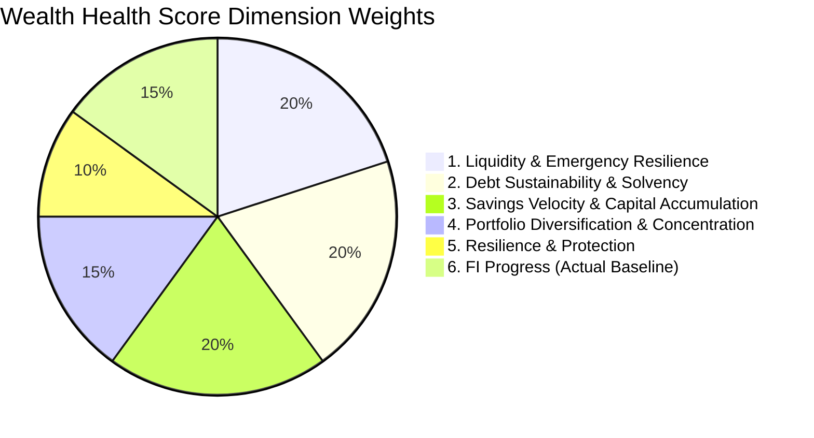

# PHASE 9B ARCHITECTURE & SCOPE SPECIFICATION
## WEALTH HEALTH SCORE + FI/FIRE HORIZON ENGINE

**Document Version:** 1.2.0 (Final Mathematical Patch)  
**Status:** REVISED / PENDING USER APPROVAL  
**Author:** Pair Programming Agent (DeepMind Antigravity)  
**Target Date:** September 2026  
**Authoritative Baseline Commit:** `ce1e257917205695d4f9820d94a4cb482e32d778` (Phase 9A Verified)  
**Project Root:** `d:\نسخ احتياطى\5\family-wealth-assessment-live`

---

## 1. EXECUTIVE SUMMARY

Phase 9B introduces an enterprise-grade, deterministic analytical intelligence layer to the **FAMILY** Wealth Management platform:
1. **Wealth Health Score**: A multi-dimensional, explainable rating system (0–100) evaluating household liquidity resilience, debt sustainability, savings velocity, portfolio diversification, risk protection, and retirement trajectory.
2. **FI/FIRE Horizon Engine**: A pure mathematical engine calculating the Financial Independence corpus, capital runway, and projected horizon date under strict deterministic conditions.

### Architectural Core Principles
- **No Gimmicks / Deterministic Truth**: The score is not an arbitrary black box or gamified metric. Every point awarded or deducted maps to an auditable formula with published weights, benchmark thresholds, and root-cause drivers.
- **Strict Classification Boundaries**:
  - **Accounting Facts**: Historical double-entry journal movements, posted balances, and cash flows.
  - **Market Valuation Facts**: Mark-to-market prices, official appraisals, and FX spot rates from valuation snapshots.
  - **Derived Metrics**: Mathematical ratios (e.g., DSCR, Emergency Runway, Operating Savings Rate, HHI).
  - **User Assumptions**: Forward-looking parameters (e.g., inflation, nominal return, safe withdrawal rate).
  - **Projections**: Pure mathematical extrapolations strictly isolated from ledger truth.
- **Zero Ledger Mutation**: Phase 9B is strictly read-only. It cannot write journal lines, create synthetic revaluations, alter equity, or mutate existing valuation snapshots.
- **Decimal.js Precision**: All financial calculations use 40-digit Decimal arithmetic, completely avoiding IEEE-754 floating-point drift.
- **Zero-Migration Compliance**: Leverages existing schema structures (`financial_goals`, `retirement_plans`, `planning_scenarios`, `emergency_fund_plans`, `debts`, `allocation_targets`, `insurance_policies`, `official_valuation_snapshots`). No Drizzle schema alterations or database migrations are required.

---

## 2. CURRENT BASELINE VERIFICATION

The codebase has completed and verified both Phase 8 and Phase 9A:

- **Repository Root:** `d:\نسخ احتياطى\5\family-wealth-assessment-live`
- **Git HEAD Commit:** `ce1e257917205695d4f9820d94a4cb482e32d778`
- **Phase 8 Baseline Commit:** `f0b16263476d0426f0564a470d7669e1158fb0a0`
- **Working Tree:** Clean (0 uncommitted changes).
- **Database Architecture:** MySQL 8.0 with Drizzle ORM (56 tables, 35 migrations: `0000` through `0034`).
- **Test Suite Status:** 39 test suites, 145 tests passing green.
- **Phase 9A Authoritative Files:**
  - `server/financialStatementsMath.ts`: Pure financial statements and reconciliation engine.
  - `server/financialStatementsRouter.ts`: API router for Book Balance Sheet, Income Statement, Cash Flows, Equity Changes, and Economic Net Worth Bridge.
  - `server/__tests__/financialStatements.test.ts`: 22 test cases verifying Invariants A–G and Controls H–J.
  - `client/src/pages/ReportsPage.tsx`: 6-tab Arabic RTL financial reporting interface.

---

## 3. EXISTING FEATURE & DATA AUDIT

An audit of the existing codebase reveals that the platform already possesses substantial raw data and partial analytical engines:

| Subsystem / Area | Active Files & Tables | Current State & Data Readiness |
| :--- | :--- | :--- |
| **Double-Entry Ledger** | `journal_entries`, `journal_lines`, `accounts`, `server/familyLedger.ts` | **Authoritative**: Complete double-entry accounting truth. Provides historical balances, revenues, operating expenses, and cash movements. |
| **Securities FIFO & Lots** | `investment_lots`, `lot_matches`, `positions`, `server/lots.ts` | **Authoritative**: Realized P&L is tracked in `lot_matches` without polluting book equity. Active cost basis is strictly isolated. |
| **Valuations & Provenance** | `official_valuation_snapshots`, `valuation_provenance`, `price_quotes`, `fx_rates`, `special_assets` | **Authoritative**: Mark-to-market valuations for securities, gold, real estate appraisals, and FX. Freshness and quality tags (`current`, `stale`, `delayed`, `manual`). |
| **Financial Statements (Phase 9A)** | `server/financialStatementsMath.ts`, `server/financialStatementsRouter.ts` | **Authoritative**: Book Balance Sheet, Income Statement, Cash Flow Statement (CFO, CFI, CFF), Statement of Changes in Equity, and Economic Net Worth Bridge. |
| **Emergency Fund Planning** | `emergency_fund_plans`, `server/emergencyFundMath.ts`, `server/familyRead.ts` | **Authoritative**: Computes monthly essential expense baseline, liquid reserves, and runway months using `cash_flow_categories.isEssential`. |
| **Debt Management** | `debts`, `debt_payments`, `server/debtMath.ts` | **Authoritative**: Tracks contractual debt principal, interest rates, minimum payments, and amortization projections. |
| **Retirement & Goals** | `retirement_plans`, `financial_goals`, `server/planningMath.ts` | **Partial**: Stores basic retirement plan parameters (`currentAge`, `retirementAge`, `currentRetirementAssets`, `monthlyContribution`, `annualSpending`, `safeWithdrawalRate`, `assumedAnnualReturn`, `assumedAnnualInflation`). Mathematical model in `planningMath.ts` is simple and deterministic. |
| **Planning Scenarios** | `planning_scenarios`, `server/scenarioMath.ts` | **Partial**: Supports scenario projection for debt, retirement, emergency, and cash flow with JSON storage for assumptions and results. Uses JS numbers rather than Decimal.js. |
| **Asset Allocation & Risk** | `risk_profiles`, `allocation_targets`, `server/allocationMath.ts` | **Authoritative**: 5 asset classes (`cash`, `equity`, `fixed_income`, `alternatives`, `other`) with target percentages and drift monitoring. |
| **Insurance Policies** | `insurance_policies`, `insurance_claims`, `insurance_premium_payments` | **Authoritative**: Covers health, life, property, motor policies, coverage amounts, and premium cadences. |

---

## 4. GAP ANALYSIS

While raw data exists across multiple tables, the platform currently lacks:
1. **Unified Health Scoring Model**: There is no engine that combines liquidity, leverage, savings rate, diversification, and insurance into an integrated, weighted score.
2. **Trailing Twelve Months (TTM) Financial Ratios**: The current system relies on single-month snapshots or user-entered spending figures instead of dynamically deriving trailing 12-month actual cash flows from posted ledger transactions.
3. **Investable Assets Disambiguation**: Current retirement projections allow users to manually type `currentRetirementAssets` rather than authoritatively deriving investable capital from liquid accounts + securities + gold while excluding personal-use real estate.
4. **Essential vs Discretionary FI Modes**: The current retirement planner only accepts a single annual spending figure, omitting Lean FIRE (essential spending only) and Fat FIRE (discretionary buffer).
5. **Real Return Math Rigor**: Existing planning functions in `server/planningMath.ts` and `server/scenarioMath.ts` either subtract inflation linearly ($r - i$) or use JS floating-point arithmetic. Phase 9B must implement exact Fisher real-rate compounding using Decimal.js:
   $$r_{\text{real}} = \frac{1 + r_{\text{nominal}}}{1 + i_{\text{inflation}}} - 1$$
6. **Data Quality & Confidence Index**: No metric currently informs the user how reliable their health score is based on history length, missing expense categories, or stale asset valuations.

---

## 5. DATA AVAILABILITY & ASSET CLASS MAPPING

### 5.1 Data Availability Matrix

| Input Parameter | Classification | Source / Resolution Mechanism |
| :--- | :--- | :--- |
| **Total Economic Net Worth** | `1. EXISTS AND AUTHORITATIVE` | Phase 9A Economic Net Worth Bridge (`server/financialStatementsMath.ts`). |
| **Book Balance Sheet Figures** | `1. EXISTS AND AUTHORITATIVE` | Pure double-entry ledger balances (`journal_lines`). |
| **Liquid Capital (Cash/Bank/Brokerage)** | `1. EXISTS AND AUTHORITATIVE` | `accounts` with type `cash`, `bank`, `wallet`, `brokerage` and `isSystemAccount = 'no'`. |
| **Investable Securities Portfolio** | `1. EXISTS AND AUTHORITATIVE` | Active lots market value (`positions` + `price_quotes`). |
| **Physical Gold / Bullion** | `1. EXISTS AND AUTHORITATIVE` | `special_assets` where `assetType = 'gold'` valued at current market quote. |
| **Personal Real Estate** | `1. EXISTS AND AUTHORITATIVE` | `special_assets` (`assetType = 'real_estate'`) appraisals. Excluded from investable capital by default. |
| **Total Debt Principal** | `1. EXISTS AND AUTHORITATIVE` | Sum of liability account credit balances in `journal_lines`. |
| **Debt Service (Annual / Monthly)** | `1. EXISTS AND AUTHORITATIVE` | Contractual minimum payments from `debts` + actual interest/fees from `debt_payments`. |
| **Operating Revenue & Inflows** | `4. DERIVABLE FROM AUTHORITATIVE DATA` | Trailing 12 Months (TTM) posted operating cash flows (CFO receipts). |
| **Total Living Expenses** | `4. DERIVABLE FROM AUTHORITATIVE DATA` | TTM operating cash disbursements from posted journal entries. |
| **Essential Living Expenses** | `4. DERIVABLE FROM AUTHORITATIVE DATA` | TTM disbursements where `cash_flow_categories.isEssential = 'yes'`. |
| **Annual Savings Velocity** | `4. DERIVABLE FROM AUTHORITATIVE DATA` | TTM Operating Cash Flow minus non-discretionary debt principal payments. |
| **Asset Class Allocation & Drift** | `1. EXISTS AND AUTHORITATIVE` | `allocation_targets` and `getRiskAllocationSummary()`. |
| **Insurance Coverage Ratio** | `4. DERIVABLE FROM AUTHORITATIVE DATA` | Active policies coverage (`insurance_policies`) vs debt and dependent exposure. |
| **Valuation Freshness & Stale Count** | `1. EXISTS AND AUTHORITATIVE` | `official_valuation_snapshots.quality` and `price_quotes.quoteStatus`. |
| **Inflation Expectation** | `5. REQUIRES USER ASSUMPTION` | Stored in `retirement_plans.assumedAnnualInflation` (Default: 3.0%). |
| **Nominal Return Expectation** | `5. REQUIRES USER ASSUMPTION` | Stored in `retirement_plans.assumedAnnualReturn` (Default: 7.0%). |
| **Safe Withdrawal Rate (SWR)** | `5. REQUIRES USER ASSUMPTION` | Stored in `retirement_plans.safeWithdrawalRate` (Default: 4.0%). |
| **Target Retirement Age** | `5. REQUIRES USER ASSUMPTION` | Stored in `retirement_plans.retirementAge` (Default: 60). |

### 5.2 Authoritative Asset Class Mapping
Phase 9B maps all household assets into the 5 authoritative asset classes defined in `drizzle/schema.ts` (`allocation_targets.assetClass`):

1. **`cash`**:
   - Accounts with `accountType IN ('cash', 'bank', 'wallet', 'brokerage')` and `isSystemAccount = 'no'`.
   - Included in **Liquid Reserves** and **Investable Assets ($A_{\text{inv}}$)**.
2. **`equity`**:
   - Public equities, mutual funds, ETFs from `positions` and `investment_lots`.
   - Included in **Investable Assets ($A_{\text{inv}}$)**.
3. **`fixed_income`**:
   - Bonds, sukuk, certificates of deposit.
   - Included in **Investable Assets ($A_{\text{inv}}$)**.
4. **`alternatives`**:
   - **Physical Gold (`special_assets` with `assetType = 'gold'`)**: Liquid bullion/coins. Included in **Investable Assets ($A_{\text{inv}}$)** at market quote.
   - **Real Estate (`special_assets` with `assetType = 'real_estate'`)**:
     - *Primary Residence / Personal-Use Property*: **EXCLUDED** from Investable Assets ($A_{\text{inv}}$) because residential housing cannot be drawn down for living expenses without displacement. Included in Total Economic Assets for Solvency (Dimension 2).
     - *Commercial / Rental Real Estate*: Capital value excluded from liquid investable capital by default. Net rental income is captured in TTM Operating Cash Inflows ($I_{\text{op}}$).
5. **`other`**:
   - Personal motor vehicles, collectibles, jewelry (`special_assets` with `assetType IN ('motor', 'other')`).
   - **EXCLUDED** from Investable Assets ($A_{\text{inv}}$) as depreciating lifestyle assets.

---

## 6. WEALTH HEALTH SCORE ARCHITECTURE

The Wealth Health Score is an explainable, deterministic index normalized to a scale of **0 to 100**, computed across **6 distinct, non-overlapping financial dimensions**:

$$\text{Wealth Health Score} = \sum_{i=1}^{6} w_i \cdot S_i$$



---

### 6.1 Dimension 1: Liquidity & Emergency Resilience (Weight: 20%)
- **Purpose**: Assesses household ability to absorb severe income disruption or emergencies without liquidating long-term investments.
- **Authoritative Inputs**:
  - Liquid Reserves ($R_{\text{liq}}$): Cash, bank balances, money-market funds, and brokerage cash.
  - Monthly Essential Outflows ($E_{\text{ess, mo}}$): TTM essential operating expenses divided by 12, plus monthly debt minimum payments.
- **Metric**: Emergency Runway (Months) = $\frac{R_{\text{liq}}}{E_{\text{ess, mo}}}$.
- **Deterministic Scoring Function (Full Domain $[0, \infty)$ Months)**:
  - If $E_{\text{ess, mo}} \le 0$: $S_1 = 100 \text{ pts}$ (no essential expense burden).
  - If Runway $\ge 12$ months: $S_1 = 100 \text{ pts}$.
  - If $6 \le \text{Runway} < 12$: $S_1 = 85 + \left(\frac{\text{Runway} - 6}{6}\right) \times 15 \text{ pts}$ ($[85, 100)$ pts).
  - If $3 \le \text{Runway} < 6$: $S_1 = 50 + \left(\frac{\text{Runway} - 3}{3}\right) \times 35 \text{ pts}$ ($[50, 85)$ pts).
  - If $1 \le \text{Runway} < 3$: $S_1 = 20 + \left(\frac{\text{Runway} - 1}{2}\right) \times 30 \text{ pts}$ ($[20, 50)$ pts).
  - If $0 \le \text{Runway} < 1$: $S_1 = \text{Runway} \times 20 \text{ pts}$ ($[0, 20)$ pts).

---

### 6.2 Dimension 2: Debt Sustainability & Solvency (Weight: 20%)
- **Purpose**: Measures balance sheet leverage, default vulnerability, and debt service burden without undefined intervals.
- **Authoritative Inputs**:
  - Total Debt Principal ($D$): Ledger liability credit balances.
  - Total Economic Assets ($A_{\text{econ}}$): From Phase 9A Economic Net Worth Bridge.
  - Annual Debt Service ($DS$): Annual contractual minimum payments + actual interest.
  - Operating Cash Flow Before Debt Service ($OCF_{\text{pre-debt}}$): TTM Operating Cash Inflows ($I_{\text{op}}$) minus TTM Essential Non-Debt Expenses.
- **Sub-Metrics**:
  - Leverage Ratio $L = \frac{D}{A_{\text{econ}}}$.
  - Debt Service Coverage Ratio $DSCR = \frac{OCF_{\text{pre-debt}}}{DS}$.

#### Deterministic Leverage Scoring ($S_{2A}$, Weight: 50% of Dimension 2, Full Domain $[0, \infty)$):
- If $A_{\text{econ}} \le 0$:
  - If $D = 0 \rightarrow 100 \text{ pts}$.
  - If $D > 0 \rightarrow 0 \text{ pts}$ (insolvent).
- If $A_{\text{econ}} > 0$:
  - $L = 0\%$: $S_{2A} = 100 \text{ pts}$ (debt-free).
  - $0\% < L \le 15\%$: $S_{2A} = 100 - \left(\frac{L}{0.15}\right) \times 10 \text{ pts}$ ($[90, 100)$ pts).
  - $15\% < L \le 30\%$: $S_{2A} = 90 - \left(\frac{L - 0.15}{0.15}\right) \times 15 \text{ pts}$ ($[75, 90)$ pts).
  - $30\% < L \le 50\%$: $S_{2A} = 75 - \left(\frac{L - 0.30}{0.20}\right) \times 25 \text{ pts}$ ($[50, 75)$ pts).
  - $50\% < L \le 65\%$: $S_{2A} = 50 - \left(\frac{L - 0.50}{0.15}\right) \times 30 \text{ pts}$ ($[20, 50)$ pts).
  - $65\% < L \le 100\%$: $S_{2A} = 20 - \left(\frac{L - 0.65}{0.35}\right) \times 20 \text{ pts}$ ($[0, 20)$ pts).
  - $L > 100\%$: $S_{2A} = 0 \text{ pts}$ (negative net worth).

#### Deterministic DSCR Scoring ($S_{2B}$, Weight: 50% of Dimension 2, Full Domain $[0, \infty)$):
- If $DS = 0$: $S_{2B} = 100 \text{ pts}$ (no debt service).
- If $OCF_{\text{pre-debt}} \le 0$: $S_{2B} = 0 \text{ pts}$ (operating deficit cannot service debt).
- If $DSCR \ge 3.0$: $S_{2B} = 100 \text{ pts}$.
- If $2.0 \le DSCR < 3.0$: $S_{2B} = 80 + \left(\frac{DSCR - 2.0}{1.0}\right) \times 20 \text{ pts}$ ($[80, 100)$ pts).
- If $1.2 \le DSCR < 2.0$: $S_{2B} = 50 + \left(\frac{DSCR - 1.2}{0.8}\right) \times 30 \text{ pts}$ ($[50, 80)$ pts).
- If $1.0 \le DSCR < 1.2$: $S_{2B} = 25 + \left(\frac{DSCR - 1.0}{0.2}\right) \times 25 \text{ pts}$ ($[25, 50)$ pts).
- If $0 < DSCR < 1.0$: $S_{2B} = \left(\frac{DSCR}{1.0}\right) \times 25 \text{ pts}$ ($[0, 25)$ pts).

Total Dimension 2 Score: $S_2 = 0.5 \cdot S_{2A} + 0.5 \cdot S_{2B} \in [0, 100]$.

---

### 6.3 Dimension 3: Savings Velocity & Capital Accumulation (Weight: 20%)
- **Purpose**: Measures the operational surplus generated from living within means and fueling wealth creation.

#### Strict Accounting Boundaries:
1. **$I_{\text{op}}$ (Operating Cash Inflows)**:
   - Trailing 12 Months (TTM) cash receipts from operating activities (CFO receipts: salary, business income, dividends, interest receipts, rental income, operating deposits).
   - **Excludes**: Debt financing proceeds (CFF cash inflows), gross securities sale proceeds (CFI cash inflows), and internal transfers.
2. **$E_{\text{op}}$ (Operating Living Expenses)**:
   - TTM cash disbursements for consumable living expenses (groceries, housing, utilities, transportation, health, education).
   - **Explicitly Includes**:
     - **Interest Expense**: Cost of debt service paid to lenders (`debt_payments.interestAmount` or journal lines debiting interest expense). Reason: interest is consumed financing cost; it does not build equity.
     - **Investment Fees & Commissions**: Brokerage and maintenance fees (`lot_matches.allocatedFee` or fee expense lines).
     - **Taxes**: Direct taxes, trading taxes, and transaction levies (`lot_matches.allocatedTax` or tax expense lines).
   - **Explicitly Excludes**:
     - **Debt Principal Repayments ($P_{\text{debt}}$)**: CFF financing cash outflow debiting liability accounts and crediting cash.
     - **Securities Purchases**: CFI investing cash outflow.
     - **Internal Transfers**: Cash movements between non-system cash accounts (Invariant D).
3. **$P_{\text{debt}}$ (Debt Principal Repayments)**:
   - CFF disbursements that reduce debt principal balances on the balance sheet.

#### Tripartite Metric Separation:
- **A) Operating Savings Rate**:
  $$\text{Operating Savings Rate} = \frac{I_{\text{op}} - E_{\text{op}}}{I_{\text{op}}}$$
- **B) Net Wealth Accumulation**:
  $$\Delta \text{Equity}_{\text{op}} = I_{\text{op}} - E_{\text{op}}$$
  $$\text{Net Wealth Accumulation Rate} = \frac{I_{\text{op}} - E_{\text{op}}}{I_{\text{op}}}$$
  *Balance-Sheet Effect of Debt Principal Repayments*: Paying down debt principal reduces cash by $P_{\text{debt}}$ and reduces liabilities by $P_{\text{debt}}$ dollar-for-dollar. It does **not** consume equity; it converts liquid cash into debt equity. Therefore, both investable cash surplus and principal paydown represent true savings generated from living below income.
- **C) Authoritative FI/FIRE Monthly Investment Contribution ($C$)**:
  $$C = \frac{I_{\text{op}} - E_{\text{op}} - P_{\text{debt}}}{12}$$
  *Why principal repayment reduces $C$*: Cash disbursed to pay down debt principal ($P_{\text{debt}}$) is no longer available in liquid form to purchase dividend-yielding stocks, ETFs, or gold. It builds equity via *liability reduction*, not *investable asset accumulation*. Once debt is paid off ($P_{\text{debt}} = 0$), the entire operational surplus unlocks for investable contributions: $C = \frac{I_{\text{op}} - E_{\text{op}}}{12}$.

#### Deterministic Scoring Function (Full Domain $(-\infty, 100\%]$):
- If $I_{\text{op}} \le 0$:
  - If $E_{\text{op}} \le 0 \rightarrow 50 \text{ pts}$ (dormant).
  - If $E_{\text{op}} > 0 \rightarrow 0 \text{ pts}$ (unfunded consumption).
- If $I_{\text{op}} > 0$:
  - Savings Rate $\ge 40\%$: $S_3 = 100 \text{ pts}$.
  - $25\% \le \text{Savings Rate} < 40\%$: $S_3 = 80 + \left(\frac{\text{Rate} - 0.25}{0.15}\right) \times 20 \text{ pts}$ ($[80, 100)$ pts).
  - $10\% \le \text{Savings Rate} < 25\%$: $S_3 = 50 + \left(\frac{\text{Rate} - 0.10}{0.15}\right) \times 30 \text{ pts}$ ($[50, 80)$ pts).
  - $0\% \le \text{Savings Rate} < 10\%$: $S_3 = 20 + \left(\frac{\text{Rate}}{0.10}\right) \times 30 \text{ pts}$ ($[20, 50)$ pts).
  - $\text{Savings Rate} < 0\%$ (Deficit): $S_3 = \max(0, 20 - 50 \times |\text{Rate}|) \text{ pts}$ ($[0, 20)$ pts).

---

### 6.4 Dimension 4: Portfolio Diversification & Concentration Risk (Weight: 15%)
- **Purpose**: Evaluates risk dispersion across the 5 authoritative asset classes and prevents single-asset vulnerability.
- **Authoritative Inputs**:
  - Asset class weights $s_k$ across 5 classes: Cash, Equity, Fixed Income, Alternatives (Gold + Real Estate), Other.
  - Top single holding weight: $h_{\max} = \max(h_j)$.
- **Sub-Metrics**:
  - Herfindahl-Hirschman Index: $HHI = \sum_{k=1}^{5} s_k^2 \in [0.20, 1.00]$.
- **Deterministic Scoring Function (Full Domain $[0.20, 1.00] \times [0, 100\%]$)**:
  - If $HHI \le 0.30$ AND $h_{\max} < 15\%$: $S_4 = 100 \text{ pts}$.
  - If $HHI \le 0.45$ AND $h_{\max} < 25\%$: $S_4 = 75 \text{ pts}$.
  - If $HHI \le 0.65$ AND $h_{\max} < 40\%$: $S_4 = 50 \text{ pts}$.
  - If $HHI > 0.65$ OR $h_{\max} \ge 40\%$: $S_4 = 25 \text{ pts}$.
  - If single holding $h_{\max} \ge 75\%$: $S_4 = 10 \text{ pts}$.

---

### 6.5 Dimension 5: Resilience & Protection (Weight: 10%)
- **Purpose**: Evaluates risk mitigation against catastrophic financial shocks and penalizes dependence on unverified/stale valuations.
- **Structure**: Divided into two independent, deterministic sub-scores (50% each):

#### Sub-Score 5A: Valuation Quality & Freshness (Weight: 5%, Domain $[0, 100\%]$)
- **Metric**: Fresh Asset Value Ratio = $\frac{\text{Asset Value with Fresh Valuations}}{\text{Total Economic Assets}}$.
- **Scoring Function**:
  - Ratio $\ge 95\%$: $S_{5A} = 100 \text{ pts}$.
  - $80\% \le \text{Ratio} < 95\%$: $S_{5A} = 75 + \left(\frac{\text{Ratio} - 0.80}{0.15}\right) \times 25 \text{ pts}$ ($[75, 100)$ pts).
  - $60\% \le \text{Ratio} < 80\%$: $S_{5A} = 50 + \left(\frac{\text{Ratio} - 0.60}{0.20}\right) \times 25 \text{ pts}$ ($[50, 75)$ pts).
  - Ratio $< 60\%$: $S_{5A} = \left(\frac{\text{Ratio}}{0.60}\right) \times 50 \text{ pts}$ ($[0, 50)$ pts).

#### Sub-Score 5B: Insurance Protection (Weight: 5%, Exact Points Allocation $[0, 100]$)
1. **Health Insurance (35 pts)**:
   - Awarded 35 pts if at least one active health insurance policy exists (`policyType = 'health'` and status is active). Else 0 pts.
2. **Life & Liability Coverage (35 pts)**:
   - If household has zero debt principal: Automatically awarded 35 pts.
   - If household has debt principal $> 0$: Awarded 35 pts if active life insurance coverage $\ge \text{Total Debt Principal}$. If coverage $> 0$ but $<$ debt, awarded $35 \times \left(\frac{\text{Coverage}}{\text{Debt}}\right) \text{ pts}$. Else 0 pts.
3. **Property & Asset Coverage (30 pts)**:
   - If household owns zero physical real estate or motor vehicles: Automatically awarded 30 pts.
   - If household owns physical property or vehicles: Awarded 30 pts if at least one active property/motor policy exists. Else 0 pts.
- Total Sub-Score: $S_{5B} = \text{Health Pts} + \text{Life Pts} + \text{Property Pts} \in [0, 100]$.

Total Dimension 5 Score: $S_5 = 0.5 \cdot S_{5A} + 0.5 \cdot S_{5B} \in [0, 100]$.

---

### 6.6 Dimension 6: FI Progress (Actual Baseline) (Weight: 15%)
- **Purpose**: Evaluates current balance sheet readiness as an objective health metric, independent of what-if scenario simulations.
- **Authoritative Inputs**:
  - Current Investable Assets ($A_{\text{inv}}$): Liquid cash + securities + physical gold. (Excludes primary real estate).
  - Objective Baseline Spending ($S_{\text{actual}}$): TTM Total Living Expenses from posted ledger disbursements.
  - Baseline Standard SWR: Fixed at $4.0\%$ (0.04).
- **Formulas**:
  $$K_{\text{FI, baseline}} = \frac{S_{\text{actual}}}{0.04}$$
  $$\text{FI Progress Ratio} = \frac{A_{\text{inv}}}{K_{\text{FI, baseline}}}$$
- **Deterministic Scoring Function (Full Domain $[0, \infty)$)**:
  - If $S_{\text{actual}} \le 0$: $S_6 = 100 \text{ pts}$ (zero living expense).
  - If FI Ratio $\ge 1.0$ (FI Achieved): $S_6 = 100 \text{ pts}$.
  - If $0.75 \le \text{FI Ratio} < 1.0$: $S_6 = 85 + \left(\frac{\text{Ratio} - 0.75}{0.25}\right) \times 15 \text{ pts}$ ($[85, 100)$ pts).
  - If $0.50 \le \text{FI Ratio} < 0.75$: $S_6 = 70 + \left(\frac{\text{Ratio} - 0.50}{0.25}\right) \times 15 \text{ pts}$ ($[70, 85)$ pts).
  - If $0.25 \le \text{FI Ratio} < 0.50$: $S_6 = 45 + \left(\frac{\text{Ratio} - 0.25}{0.25}\right) \times 25 \text{ pts}$ ($[45, 70)$ pts).
  - If $0 \le \text{FI Ratio} < 0.25$: $S_6 = \max(10, 180 \times \text{Ratio}) \text{ pts}$ ($[10, 45)$ pts).

---

## 7. ASSET-SPECIFIC VALUATION FRESHNESS POLICIES

To prevent arbitrary single-threshold rules, Phase 9B enforces asset-specific freshness criteria matching each asset class's market reality:

| Asset Class / Instrument Type | Source Table | Fresh Threshold | Stale Threshold | Action Upon Stale |
| :--- | :--- | :---: | :---: | :--- |
| **Listed Securities & Equities** | `price_quotes` | $\le 24$ hours | $> 7$ calendar days | Mark stale; penalize Sub-Score 5A; flag in audit. |
| **Foreign Exchange Rates** | `fx_rates` | $\le 24$ hours | $> 3$ calendar days | Mark stale; trigger currency conversion warning. |
| **Physical Gold Bullion** | `special_asset_valuations` | $\le 48$ hours | $> 7$ calendar days | Mark stale; penalize Sub-Score 5A. |
| **Real Estate Appraisals** | `special_asset_valuations` | $\le 365$ days (1 yr) | $> 365$ days | Mark review required; penalize Sub-Score 5A. |
| **Manual / Other Valuations** | `special_asset_valuations` | $\le 90$ days | $> 90$ days | Mark stale; penalize Sub-Score 5A. |

---

## 8. COMPLETE FI/FIRE HORIZON ENGINE & MATHEMATICAL DOMAIN

### 8.1 Recurrence Relation
Let $A(m)$ represent investable assets at month $m$:
$$A(m) = A_0 (1 + r_m)^m + C \cdot \frac{(1 + r_m)^m - 1}{r_m}$$

Where:
- $A_0$: Current Investable Assets ($A_{\text{inv}}$)
- $K_{\text{FI}}$: Financial Independence Target Corpus ($S_{\text{target}} / SWR$)
- $C$: Authoritative Monthly Net Cash Surplus ($[I_{\text{op}} - E_{\text{op}} - P_{\text{debt}}] / 12$)
- $r_m = (1 + r_{\text{real}})^{\frac{1}{12}} - 1$
- $r_{\text{real}} = \frac{1 + r_{\text{nom}}}{1 + i_{\text{inf}}} - 1$ (Fisher Exact Real Rate)

Integer horizon rule: In all reachable branches, the solved horizon $m^*$ is the **smallest non-negative integer** $m$ such that $A(m) \ge K_{\text{FI}}$:
$$m^* = \min \{ m \in \mathbb{Z}_{\ge 0} \mid A(m) \ge K_{\text{FI}} \} = \lceil m_{\text{real}} \rceil$$

---

### 8.2 Comprehensive State Matrix for Horizon $m^*$ (Months)

```mermaid
graph TD
    Start{Current Assets vs Target} -->|A0 >= KFI| Achieved[m* = 0: FI Achieved]
    Start -->|A0 < KFI| RealRate{Real Return r_real}
    
    RealRate -->|r_real = 0| ZeroR{Monthly Savings C}
    ZeroR -->|C > 0| Linear[m* = ceil (KFI - A0) / C]
    ZeroR -->|C <= 0| Unreachable1[Unreachable: Zero Growth & No Savings]
    
    RealRate -->|r_real > 0| PosR{Monthly Savings C}
    PosR -->|C > 0| PosC[m* = ceil ln(Num / Denom) / ln(1 + r_m)]
    PosR -->|C = 0| ZeroC[m* = ceil ln(KFI / A0) / ln(1 + r_m)]
    PosR -->|C < 0| NegC{A0 vs A_inf = -C / r_m}
    NegC -->|A0 <= A_inf| Unreachable2[Unreachable: Depleting]
    NegC -->|A0 > A_inf| ReachableNegC[m* = ceil ln(Num / Denom) / ln(1 + r_m)]
    
    RealRate -->|r_real < 0| NegR{C > 0 and KFI < C / |r_m|?}
    NegR -->|Yes: Surplus Outpaces Decay| LogNeg[m* = ceil ln(Num / Denom) / ln(1 - |r_m|)]
    NegR -->|No: Decay Exceeds Limit| Unreachable3[Unreachable: Asymptotic Bound Exceeded]
```

#### Deterministic State Specifications:

1. **State 1: FI Already Achieved ($A_0 \ge K_{\text{FI}}$)**:
   - $m^* = 0$ months.
   - Status: `achieved`.
   - Valid for all $r_{\text{real}}$ and all $C$.

2. **State 2: Zero Real Growth ($r_{\text{real}} = 0 \implies r_m = 0$)**:
   - Recurrence: $A(m) = A_0 + C \cdot m$.
   - **Case 2A ($C > 0$)**:
     $$m^* = \left\lceil \frac{K_{\text{FI}} - A_0}{C} \right\rceil$$
     Status: `reachable_linear`.
   - **Case 2B ($C \le 0$)**:
     $A(m) \le A_0 < K_{\text{FI}}$ for all $m \ge 0$.
     $m^* = \text{null}$. Status: `unreachable_zero_growth`.

3. **State 3: Positive Real Growth ($r_{\text{real}} > 0 \implies r_m > 0$)**:
   - **Case 3A ($C > 0$)**:
     Compounding growth dominates. Analytical exact solution:
     $$m_{\text{real}} = \frac{\ln\left( \frac{K_{\text{FI}} + C / r_m}{A_0 + C / r_m} \right)}{\ln(1 + r_m)}, \quad m^* = \lceil m_{\text{real}} \rceil$$
     Status: `reachable_compounding`.
   - **Case 3B ($C = 0$)**:
     Pure compounding on initial assets:
     $$m_{\text{real}} = \frac{\ln\left( \frac{K_{\text{FI}}}{A_0} \right)}{\ln(1 + r_m)}, \quad m^* = \lceil m_{\text{real}} \rceil$$
     Status: `reachable_compounding`.
   - **Case 3C ($C < 0$, Monthly Deficit)**:
     Define the critical steady-state equilibrium capital:
     $$A_{\text{inf}} = \frac{-C}{r_m} = \frac{|C|}{r_m} > 0$$
      - **Sub-case 3C.1 ($A_0 \le A_{\text{inf}}$)**:
        - If $A_0 < A_{\text{inf}}$: monthly withdrawals $|C|$ strictly exceed portfolio returns $A_0 \cdot r_m$, so the trajectory monotonically decreases below $A_0$ toward depletion.
        - If $A_0 = A_{\text{inf}}$: portfolio returns exactly match monthly withdrawals ($A_0 \cdot r_m = -C$), yielding a **stationary fixed equilibrium** $A(m) = A_{\text{inf}}$ for all $m \ge 0$. This is a stationary equilibrium, NOT depletion toward zero. However, since $A_0 < K_{\text{FI}} \implies K_{\text{FI}} > A_{\text{inf}}$, the target $K_{\text{FI}}$ is never reached.
        In both cases, target $K_{\text{FI}}$ is mathematically unreachable: $m^* = \text{null}$. Status: `unreachable_positive_return_negative_contribution`.
     - **Sub-case 3C.2 ($A_0 > A_{\text{inf}}$)**:
       Since $A_0 > A_{\text{inf}}$, current portfolio returns outpace withdrawals ($A_0 \cdot r_m > |C|$). The recurrence is strictly monotonic increasing toward $K_{\text{FI}}$ ($K_{\text{FI}} > A_0 > A_{\text{inf}}$).
       Analytical exact solution:
       $$m_{\text{real}} = \frac{\ln\left( \frac{K_{\text{FI}} - A_{\text{inf}}}{A_0 - A_{\text{inf}}} \right)}{\ln(1 + r_m)}, \quad m^* = \lceil m_{\text{real}} \rceil$$
       Status: `reachable_compounding`.

4. **State 4: Negative Real Growth ($r_{\text{real}} < 0 \implies -1 < r_m < 0$)**:
   - Let $\rho = -r_m = |r_m| \in (0, 1)$.
   - Recurrence: $A(m) = A_0 (1 - \rho)^m + \frac{C}{\rho} [1 - (1 - \rho)^m]$.
   - As $m \to \infty$, $(1 - \rho)^m \to 0$, so the asymptotic equilibrium is:
     $$A_{\infty} = \frac{C}{\rho} = \frac{C}{|r_m|}$$
   - **Case 4A ($C \le 0$)**:
     Assets decay monotonically toward 0. Target $K_{\text{FI}} > A_0$ is mathematically unreachable.
     $m^* = \text{null}$. Status: `unreachable_deficit`.
   - **Case 4B ($C > 0$ AND $K_{\text{FI}} \ge A_{\infty} = \frac{C}{|r_m|}$)**:
     The target is **mathematically unreachable** because the maximum capital the household can ever accumulate under purchasing power decay is bounded by $A_{\infty} \le K_{\text{FI}}$.
     $m^* = \text{null}$. Status: `unreachable_negative_real_return`.
   - **Case 4C ($C > 0$ AND $K_{\text{FI}} < A_{\infty} = \frac{C}{|r_m|}$)**:
     Since $A_0 < K_{\text{FI}} < A_{\infty}$, the monthly savings surplus is strong enough to reach the target before purchasing power decay plateaus.
     Exact analytical solution:
     $$m_{\text{real}} = \frac{\ln\left( \frac{C / |r_m| - K_{\text{FI}}}{C / |r_m| - A_0} \right)}{\ln(1 - |r_m|)}, \quad m^* = \lceil m_{\text{real}} \rceil$$
     Status: `reachable_decay_overcome`.

---

## 9. FI PROGRESS VS. FIRE HORIZON SIMULATOR

The platform strictly separates the **Objective Health Metric** from the **Interactive Planning Simulator**:

| Concept | Dimension 6: FI Progress | FI / FIRE Horizon Simulator |
| :--- | :--- | :--- |
| **Purpose** | Objective Balance Sheet Health Score (0–100). | Forward-looking interactive scenario planning. |
| **Core Question** | *"بناءً على واقع الإنفاق الفعلي لآخر 12 شهرًا، ما نسبة هدف الاستقلال المالي المحقق حاليًا؟"* | *"وفق خطتك المستقبلية ومعدلات العائد والتضخم والسحب المدخلة، متى ستصل للهدف؟"* |
| **Spending Basis** | Fixed to **TTM Actual Living Expenses** ($S_{\text{actual}}$). | User can toggle: Actual TTM, Essential TTM (Lean), or Custom Budget (Fat). |
| **SWR Assumption** | Fixed to standard **4.0%**. | User-configurable (e.g., 3.25%, 4.0%, 4.5%). |
| **Return Assumptions**| None (Point-in-time capital ratio). | 3 Standard Scenarios (Conservative / Base / Optimistic). |
| **Arabic UI Label** | **"نسبة التقدم نحو الاستقلال المالي"** | **"محاكي أفق الاستقلال المالي — FIRE"** |
| **UI Subtitle** | *مقياس موضوعي مشتق بالكامل من الدفتر وسجلات الإنفاق الفعلية* | *إسقاط حتمي يعتمد على افتراضات التضخم والعائد ومعدل السحب* |

---

## 10. DETERMINISTIC DATA QUALITY & CONFIDENCE MODEL

Phase 9B rejects ambiguous confidence rules. The final confidence rating (`high`, `medium`, `low`) is derived from an unambiguous, deterministic decision tree:

### 10.1 Metrics Calculation
1. **History Length ($H_{\text{months}}$)**: Number of full calendar months of posted double-entry ledger history prior to `asOf`.
2. **Data Completeness ($C_{\text{comp}}$)**:
   $$C_{\text{comp}} = \frac{1}{2} \left( \frac{N_{\text{accounts, valid}}}{N_{\text{accounts}}} \right) + \frac{1}{2} \left( \frac{V_{\text{categorized}}}{V_{\text{total}}} \right)$$
   Where $N_{\text{accounts, valid}}$ are accounts with confirmed reconcile/posting history, and $V_{\text{categorized}}$ is the volume of expenses with assigned categories.
3. **Valuation Freshness Ratio ($V_{\text{fresh}}$)**: Percentage of Total Economic Assets backed by fresh valuations according to Section 7 policies.
4. **Currency Resolution**: Checked for any unvalued foreign currency balances.

### 10.2 Deterministic Decision Tree
```text
IF (Unvalued Foreign Currencies > 0) THEN
    Confidence = "low"
    Warning: "توجد عملات أجنبية بدون سعر صرف معتمد إلى عملة الأساس"
ELSE IF (H_months < 6 OR C_comp < 0.75 OR V_fresh < 0.65) THEN
    Confidence = "low"
    Warning: "تاريخ الدفتر أقل من 6 أشهر أو نسبة البيانات المكتملة غير كافية"
ELSE IF (H_months >= 12 AND C_comp >= 0.90 AND V_fresh >= 0.85) THEN
    Confidence = "high"
ELSE
    Confidence = "medium"
END IF
```

---

## 11. FI MATHEMATICAL PRECISION & DECIMAL ARITHMETIC

Phase 9B enforces strict mathematical precision rules:
1. **Decimal.js Policy**: All monetary values, rates, returns, and ratios are represented and calculated using `Decimal.js` configured at **40 digits of precision**.
2. **No IEEE-754 Floats**: JavaScript native `number`, `Math.pow()`, `Math.log()`, and floating-point operators (`/`, `*`, `+`, `-`) are strictly prohibited in financial statement, scoring, and projection math.
3. **High-Precision Logarithm Implementation**:
   - For horizon solving $m_{\text{real}} = \frac{\ln(Y)}{\ln(X)}$, the calculation engine uses a high-precision Decimal natural logarithm routine:
     $$\ln(z) = 2 \sum_{k=0}^{\infty} \frac{1}{2k + 1} \left( \frac{z - 1}{z + 1} \right)^{2k + 1}$$
     Evaluated using Decimal arithmetic until term convergence $< 10^{-40}$.
4. **Smallest Integer Horizon**: The output integer horizon $m^*$ is the ceiling $\lceil m_{\text{real}} \rceil$, verified to satisfy $A(m^*) \ge K_{\text{FI}}$ in 40-digit Decimal arithmetic.
5. **Determinism**: Identical inputs on any operating system produce bit-for-bit identical horizon months and score points.

---

## 12. API CONTRACT & VALIDATION RULES

The API is exposed via `server/wealthHealthRouter.ts` mounted under `trpc.family.wealthHealth`:

### Procedure 1: `getScoreCard`
- **Input**: `{ asOf?: number }`
- **Validation**: `asOf` must be a positive integer $\le \text{Date.now()} + 5 \text{ min}$.
- **Output**: Full 6-dimension scorecard, individual sub-scores, root-cause drivers, confidence rating, completeness percentage, and audit warnings.

### Procedure 2: `getFireStatus`
- **Input Schema**:
  ```typescript
  z.object({
    asOf: z.number().int().positive().max(Date.now() + 300_000).optional(),
    spendingMode: z.enum(["actual_ttm", "essential_ttm", "custom"]).default("actual_ttm"),
    customSpending: z.string().trim().optional(),
    customSwr: z.string().trim().optional(),
    customNominalReturn: z.string().trim().optional(),
    customInflation: z.string().trim().optional(),
  })
  ```
- **Strict Validation Rules**:
  1. If `spendingMode === 'custom'`: `customSpending` is **mandatory**, must be a valid positive Decimal $> 0$ and $\le 10^{12}$. If missing, reject with `BAD_REQUEST`: `"يجب إدخال قيمة الإنفاق السنوي المخصص"`.
  2. If `spendingMode !== 'custom'`: `customSpending` must be omitted or null. If provided, reject with `BAD_REQUEST`.
  3. `customSwr`: If provided, must parse to Decimal in $(0, 100]$. Defaults to baseline in `retirement_plans` (or 4.0%).
  4. `customNominalReturn`: If provided, must parse to Decimal in $[-50, 100]$. Defaults to 7.0%.
  5. `customInflation`: If provided, must parse to Decimal in $[-20, 100]$. Defaults to 3.0%.

### Procedure 3: `saveAssumptions`
- **Input**: `{ retirementAge: number (18-100), safeWithdrawalRate: string, assumedAnnualReturn: string, assumedAnnualInflation: string }`
- **Authorization**: `editor` role required. Updates `retirement_plans` table for the workspace profile.

---

## 13. PERFORMANCE, CACHING & DATABASE INDEX REUSE

Phase 9B reuses the existing Phase 8 in-memory cache helper `getCachedReadModel` from `server/readModelCache.ts`:

- **Cache Key**: `wealth-health:${workspaceId}:${asOfTimestamp}`
- **Cache TTL**: 60 seconds.
- **Cache Invalidation**: Automatically invalidated upon new journal entry postings, debt payments, or asset revaluations.
- **Existing Database Indexes Reused (Zero Schema Changes)**:
  1. `journal_lines_workspace_account_idx` on `journal_lines (workspaceId, accountId)`
  2. `events_workspace_occurred_idx` on `financial_events (workspaceId, occurredAt)`
  3. `events_workspace_status_occurred_idx` on `financial_events (workspaceId, status, occurredAt)`
  4. `quotes_workspace_instrument_asof_idx` on `price_quotes (workspaceId, instrumentId, asOf)`
  5. `fx_rates_pair_asof_idx` on `fx_rates (workspaceId, fromCurrency, toCurrency, asOf)`
  6. `official_valuation_workspace_asof_idx` on `official_valuation_snapshots (workspaceId, valuationAsOf)`
  7. `debts_workspace_status_idx` on `debts (workspaceId, status)`
  8. `insurance_workspace_status_idx` on `insurance_policies (workspaceId, status)`

---

## 14. ENTERPRISE ARABIC RTL UI/UX PROPOSAL

A new dedicated page will be created: `client/src/pages/WealthHealthPage.tsx`, accessible via the main navigation under **"الثروة والصحة المالية"** (`/family/wealth-health`).

### Dashboard Layout:
1. **Hero Gauge Card (مؤشر الصحة المالية الشامل)**:
   - Circular visual gauge with animated score (0–100) and status badge:
     - 85–100: *ممتاز (مرونة مالية واستقرار استثنائي)*
     - 70–84: *جيد (نمو متوازن ومخاطر مضبوطة)*
     - 50–69: *متوسط (توجد جوانب تحتاج إلى تدعيم)*
     - < 50: *حرج (مخاطر سيولة أو مديونية مرتفعة)*
   - Data Confidence Pill: عالية / متوسطة / منخفضة.
2. **6 Dimension Breakdown Cards (أبعاد الصحة المالية)**:
   - Each card displays score (0–100), current actual ratio, benchmark target, and actionable root-cause driver.
3. **FI / FIRE Projection Panel (أفق الاستقلال المالي والتقاعد)**:
   - Section Header: **"نسبة التقدم نحو الاستقلال المالي"** vs **"محاكي أفق الاستقلال المالي — FIRE"**.
   - Interactive Progress Bar with percentage achieved.
   - 3-Scenario Comparison Grid: **المتحفظ** vs **الأساسي** vs **المتفائل**.
   - Solved horizon in years and months, projected FI date, and savings surplus gap.
4. **Interactive Assumptions Drawer / Controls**:
   - Sliders and input fields for inflation, expected return, and withdrawal rate with instant real-time recalculation.
5. **Data Quality & Actionable Warnings**:
   - Identifies stale valuations, unclassified expenses, or insurance gaps with one-click navigation to resolve them.

---

## 15. SECURITY, PRIVACY & ISOLATION

1. **Workspace Isolation**: All queries enforce `workspaceId = family.workspace.id`.
2. **Privacy Masking**: Fully integrated with `SensitiveValue` component. When privacy mode is enabled, all financial figures and net worth balances are masked (`••••••`), while dimensionless scores (0–100) and percentages remain readable.
3. **Role-Based Authorization**:
   - `viewer`: Read-only access to scores, projections, and reports.
   - `editor` / `owner`: Authorized to update baseline assumptions.

---

## 16. TESTING STRATEGY (MINIMUM 26 TESTS)

A dedicated test suite will be implemented in `server/__tests__/wealthHealth.test.ts`:

1. **Liquidity Scoring Boundaries**:
   - Runway $\ge 12$ months $\rightarrow 100$ pts.
   - Runway $= 6$ months $\rightarrow 85$ pts.
   - Runway $< 1$ month $\rightarrow < 20$ pts.
   - Zero living expense $\rightarrow 100$ pts.
2. **Debt Scoring Continuity (Zero Undefined Intervals)**:
   - Debt-to-Assets: 0%, 10%, 15%, 25%, 30%, 45%, 50%, 60%, 65%, 80%, 100%, 120%.
   - DSCR: 0, 0.8, 1.0, 1.15, 1.2, 1.8, 2.0, 2.5, 3.0, 4.0.
3. **Savings Velocity & Wealth Accumulation**:
   - Operating Savings Rate formula verification.
   - Verifies debt principal repayments count in capital accumulation.
   - Verifies $C = (I_{\text{op}} - E_{\text{op}} - P_{\text{debt}}) / 12$.
   - Verifies internal transfers produce 0 impact.
   - Verifies deficit spending produces penalized scores.
4. **Resilience & Protection (Dimension 5)**:
   - Full insurance points with active health, life (covering debt), and property.
   - Debt-free household receiving automatic life insurance points.
   - Asset-free household receiving automatic property insurance points.
5. **FI/FIRE Horizon Complete Domain**:
   - $A_0 \ge K_{\text{FI}} \implies m^* = 0$ (`achieved`).
   - $r_{\text{real}} = 0, C > 0 \implies$ linear exact integer months.
   - $r_{\text{real}} = 0, C \le 0 \implies \text{null}$ (`unreachable_zero_growth`).
   - $r_{\text{real}} > 0, C > 0 \implies$ compounding exact integer months.
   - $r_{\text{real}} > 0, C = 0 \implies$ pure compounding exact integer months.
   - $r_{\text{real}} > 0, C < 0, A_0 \le A_{\text{inf}} \implies \text{null}$ (`unreachable_positive_return_negative_contribution`).
   - $r_{\text{real}} > 0, C < 0, A_0 > A_{\text{inf}} \implies$ exact integer months (`reachable_compounding`).
   - $r_{\text{real}} < 0, C > 0, K_{\text{FI}} < C / |r_m| \implies$ exact integer months (`reachable_decay_overcome`).
   - $r_{\text{real}} < 0, C > 0, K_{\text{FI}} \ge C / |r_m| \implies \text{null}$ (`unreachable_negative_real_return`).
   - $r_{\text{real}} < 0, C \le 0 \implies \text{null}$ (`unreachable_deficit`).
6. **High-Precision Decimal Arithmetic**:
   - Verifies natural logarithm and Fisher compounding precision against pre-calculated Decimal benchmarks.
7. **Confidence & Stale Valuation Rules**:
   - Stale securities ($>7$ days) and stale appraisals ($>365$ days) trigger confidence drop.
   - History $<6$ months strictly forced to `low` confidence.

---

## 17. ACCOUNTING & FINANCIAL SAFETY REVIEW

| # | Safety Question | Explicit Answer & Architectural Guarantee |
| :-: | :--- | :--- |
| **1** | *Can Phase 9B alter ledger truth?* | **NO**. Phase 9B is strictly read-only. |
| **2** | *Can it alter valuation truth?* | **NO**. It reads existing `official_valuation_snapshots` and price quotes without modifying them. |
| **3** | *Can it create journal entries?* | **NO**. The engine has zero reference to journal posting routines. |
| **4** | *Can it inject realized P&L into equity?* | **NO**. Realized P&L remains authoritative in `lot_matches` and is never synthesized into book equity. |
| **5** | *Can it double-count unrealized appreciation?* | **NO**. Read directly from the Phase 9A Economic Bridge. |
| **6** | *Can internal transfers be mistaken for savings?* | **NO**. The cash flow engine filters out internal transfers (Phase 9A Invariant D). |
| **7** | *Can debt principal be mistaken for expense?* | **NO**. Debt principal repayments are classified as Financing Cash Flows (CFF) and capital accumulation. |
| **8** | *Can FX translation be mistaken for investment return?* | **NO**. FX translation effects are isolated strictly in currency translation reserves. |
| **9** | *Can illiquid assets be incorrectly treated as FI capital?* | **NO**. Primary residence real estate is explicitly excluded from investable assets. |
| **10** | *Can stale valuations create false FI progress?* | **NO**. Valuation freshness controls penalize the confidence index and flag stale valuations. |
| **11** | *Can assumptions contaminate historical facts?* | **NO**. Assumptions are stored separately from historical facts and labeled as projections. |
| **12** | *Can the score create a false impression of accounting accuracy?* | **NO**. The UI displays explicit disclaimers: "تحليل حتمي مشتق من المعطيات والافتراضات، لا يمثل حقيقة محاسبية ملزمة أو ضمان عائد". |

---

## 18. SCHEMA & MIGRATION DECISION

### DECISION: ZERO SCHEMA CHANGES (CONFIRMED & LOCKED)

**Justification**:
1. All required historical inputs (cash accounts, securities lots, debt obligations, insurance policies, cash flow categories, and official valuations) already exist and are active in migrations `0000` through `0034`.
2. Baseline retirement assumptions can be stored in the existing `retirement_plans` table.
3. Multi-scenario planning results can be persisted in the existing `planning_scenarios` table (`scenarioType = 'retirement'`).
4. Ephemeral calculations run on-the-fly in memory.
5. **Strict Constraint**: If any field is discovered to be missing during future work, it will **NOT** be silently invented; it will be formally marked as a blocking dependency instead.
6. Therefore:
   - `drizzle/schema.ts` **UNCHANGED (0 diff)**.
   - `drizzle/` migrations **UNCHANGED (0 new migrations)**.

---

## 19. SCOPE OPTIONS

### Option 1: Basic Health Widgets (Minimalist)
- **Scope**: Simple ratio cards added to dashboard; basic retirement formula; no scenario engine.
- **Recommendation**: **REJECTED** (Gimmicky, lacks explainability).

### Option 2: Enterprise Wealth Health Score + FI/FIRE Engine (Recommended)
- **Scope**: Full 6-dimension explainable scoring model, TTM cash flow integration, 3-scenario deterministic FI/FIRE horizon engine, Data Quality/Confidence index, dedicated Arabic RTL page (`WealthHealthPage.tsx`), zero schema changes.
- **Recommendation**: **RECOMMENDED**.

### Option 3: Advanced Stochastic Engine with Schema Expansion
- **Scope**: Option 2 plus Monte Carlo simulations and new database tables for historical score snapshots.
- **Recommendation**: **DEFERRED TO PHASE 12**.

---

## 20. RECOMMENDED PHASE 9B SCOPE

Implement **Option 2: Enterprise Wealth Health Score + FI/FIRE Engine**:
1. `server/wealthHealthMath.ts`: Pure Decimal.js engine for all 6 dimensions, TTM cash flow aggregation, scoring normalization, and Fisher FI horizon calculation.
2. `server/wealthHealthRouter.ts`: Dedicated tRPC analytical router.
3. Mount `wealthHealthRouter` into `server/familyRouter.ts`.
4. Comprehensive test suite in `server/__tests__/wealthHealth.test.ts`.
5. Dedicated frontend dashboard: `client/src/pages/WealthHealthPage.tsx`.
6. Route integration in `client/src/App.tsx`.

---

## 21. EXACT FUTURE FILE CHANGE PLAN

### Files to CREATE (Exactly 4 files):
1. `server/wealthHealthMath.ts` (Pure mathematical calculation engine, Decimal.js, 40 digits).
2. `server/wealthHealthRouter.ts` (tRPC analytical endpoints and read queries).
3. `server/__tests__/wealthHealth.test.ts` (Comprehensive automated test suite, minimum 26 tests).
4. `client/src/pages/WealthHealthPage.tsx` (Enterprise Arabic RTL UI with score cards, scenario tables, and interactive controls).

### Files to MODIFY (Exactly 2 files):
1. `server/familyRouter.ts` (Mount `wealthHealthRouter` under `trpc.family.wealthHealth`).
2. `client/src/App.tsx` (Add route `/family/wealth-health` and navigation item).

### Files to PRESERVE UNTOUCHED:
- `drizzle/schema.ts` (**MUST NOT BE MODIFIED**).
- `drizzle/` migrations 0000–0034 (**MUST NOT BE MODIFIED**).
- `server/financialStatementsMath.ts` (**PRESERVE PHASE 9A INVARIANTS**).
- `server/financialStatementsRouter.ts` (**PRESERVE PHASE 9A INVARIANTS**).
- `server/familyLedger.ts` (**PRESERVE LEDGER SOVEREIGNTY**).

---

## 22. DEFERRED ITEMS

- **Monte Carlo Stochastic Simulation**: Deferred to Phase 12 (Advanced Analytics & AI).
- **Tax Optimization & Multi-Jurisdictional Tax Brackets**: Deferred to Phase 10.
- **Automated Portfolio Rebalancing Orders**: Deferred to Phase 11.
- **Estate & Generational Inheritance Modeling**: Deferred to Phase 13.

---

## 23. RISKS & MITIGATIONS

| Identified Risk | Severity | Mitigation Strategy |
| :--- | :---: | :--- |
| **Floating-point drift in compound interest** | HIGH | Enforce `Decimal.js` (40 digits precision) with custom Decimal natural logarithm for horizon solving. |
| **Misleading FI progress due to personal real estate** | HIGH | Automatically filter out primary residential real estate from investable assets ($A_{\text{inv}}$). |
| **Stale asset valuations giving false health score** | MEDIUM | Enforce asset-specific freshness policies; drop score and confidence rating when valuations exceed thresholds. |
| **Internal cash transfers inflating savings rate** | HIGH | Leverage Phase 9A's Invariant D to ensure internal transfers produce exactly zero net cash flow impact. |
| **Incomplete transaction history distorting runway** | MEDIUM | Require minimum 6 months of data for medium confidence, and 12 months for high confidence. |

---

## 24. ACCEPTANCE CRITERIA

1. **Mathematical Correctness**:
   - All 6 dimensions score between 0 and 100 with zero undefined intervals.
   - Total score equals the exact weighted sum.
   - FI Horizon formula accurately handles all mathematical states ($A_0 \ge K_{\text{FI}}$, $r_{\text{real}} > 0$, $r_{\text{real}} = 0$, $r_{\text{real}} < 0$).
2. **Accounting Invariants Preserved**:
   - Zero ledger writes or mutations.
   - Invariants A through G remain passing green.
3. **Zero Migration**:
   - `git diff -- drizzle/schema.ts` produces 0 lines.
   - `git diff -- drizzle/` produces 0 lines.
4. **Verification**:
   - `pnpm check` passes with 0 TypeScript errors.
   - All 145 existing tests + all new Phase 9B tests pass.
   - Production build `pnpm build` succeeds.
5. **UI / UX**:
   - Professional Arabic RTL design, dark/light compatible, responsive, and privacy-mode compliant.

---

## 25. FINAL RECOMMENDATION

Proceed with **Option 2 (Enterprise Wealth Health Score + FI/FIRE Engine)** under strict **Zero-Migration** constraints. This delivers immediate, high-value strategic decision support to the family office while maintaining absolute ledger sovereignty and mathematical rigor.

---

## 26. REPORT DECISION BLOCK

```text
PHASE 9B PLANNING STATUS:
FINAL REVIEW READY

PHASE 9B IMPLEMENTATION:
NOT STARTED

IMPLEMENTATION AUTHORIZATION:
NOT GRANTED

SCHEMA CHANGES:
ZERO

MIGRATIONS:
ZERO

REVISION:
1.2 FINAL MATHEMATICAL PATCH
```

---

## 27. REVISION 1.2 MATHEMATICAL PATCH REVIEW STATUS

- **Architecture:** Approved in principle
- **Mathematical specification:** Fully patched (Complete case split for $r_m > 0$ with $C < 0$, $A_{\text{inf}} = -C / r_m$, smallest non-negative integer horizon $m^* = \min \{ m \in \mathbb{Z}_{\ge 0} \mid A(m) \ge K_{\text{FI}} \}$)
- **Savings definitions:** Tripartite model finalized ($I_{\text{op}}$, $E_{\text{op}}$ including interest/fees/taxes, $P_{\text{debt}}$ capital accumulation, authoritative FI contribution $C$)
- **UI Distinctions:** Formally labeled Dimension 6 (`"نسبة التقدم نحو الاستقلال المالي"`) vs Simulator (`"محاكي أفق الاستقلال المالي — FIRE"`)
- **Implementation authorization:** NOT GRANTED
- **Schema changes:** ZERO
- **Migrations:** ZERO
- **Source-code changes:** ZERO
